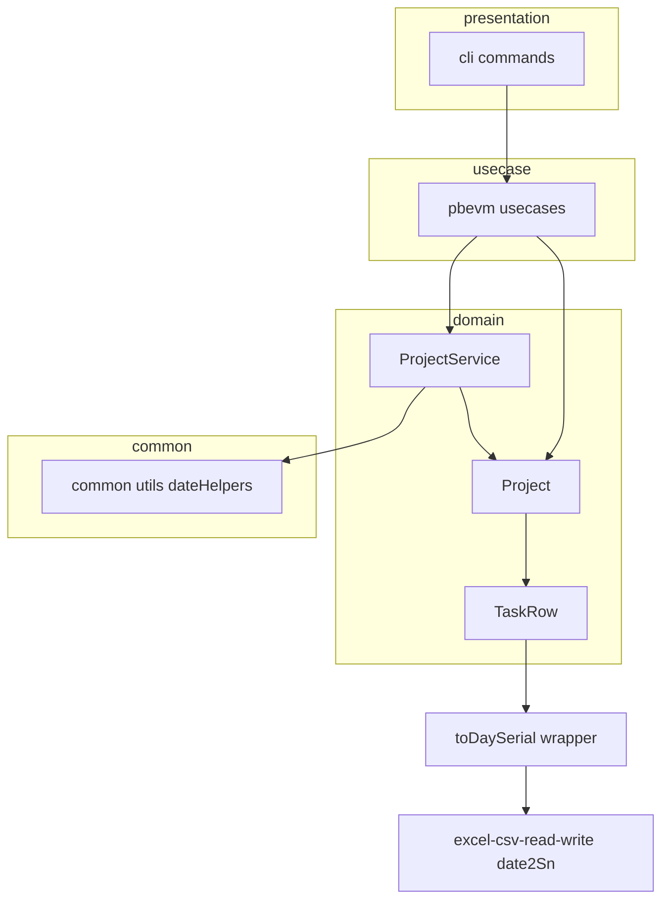
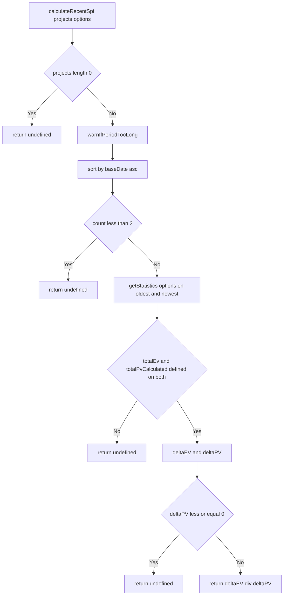
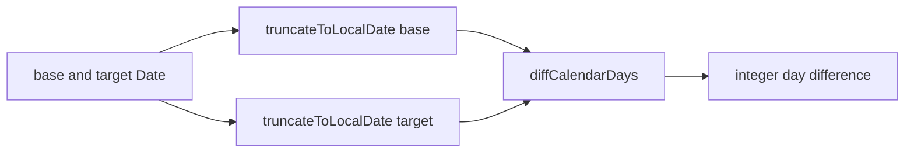

# 設計書: phase0-bugfix-0.0.29

## 概要

**目的**: 本 spec は evmtools-node の EVM 計算コアに存在する確定バグ（期間SPI の算出方式・空 diff の undefined・日付境界群）を一括修正し、数値の正確性を回復する。後続フェーズ（phase1〜4）が安全に依存できるコア基盤を確立することが価値である。

**ユーザー**: ライブラリ利用側（masatomix/task の evmtools スキル、evmtools-webui）が、SPI 閾値判定・完了予測・遅延統計のために本ライブラリの数値を利用する。

**インパクト**: `ProjectService.calculateRecentSpi` の戻り値が「累積SPIの平均」から「窓端2点の ΔEV/ΔPV」に変わる（**Behavior Change**）。日付境界修正により遅延日数・稼働日 PV・完了判定が TZ/時刻に依存せず一貫する。

### ゴール
- `calculateRecentSpi` を #139 仕様（ΔEV/ΔPV、ΔPV<=0 は undefined、1点は undefined）に置換（シグネチャ不変）
- `calculateProjectDiffs([])` が全フィールド 0 / `hasDiff:false` のデフォルト ProjectDiff を返す
- 日付ヘルパー（`truncateToLocalDate`・`diffCalendarDays`）を新設し、遅延日数・シリアル比較・`finished`・親タスク土日混入を解消
- CI で TZ=Asia/Tokyo / TZ=UTC の二重テスト実行
- feature/master 設計書・EVM-MANAGEMENT-GUIDE の同期、Issue 整理、release/0.0.29 準備

### 非ゴール
- Earned Schedule 等の新指標（phase3）
- 軽微 Issue 実装（phase1）、task スキルロジック取り込み（phase2）
- task リポジトリ側のワークアラウンド撤去そのもの（本 spec は「撤去可能なことの検証」まで）
- `calcUtils.round` の丸め改善（工数超過時は phase1 へ繰り越し）
- 親PV=子リーフ合計方式への集計経路転換（将来課題として比較のみ記録）

## 境界コミットメント

### この spec が担うもの
- `ProjectService.calculateRecentSpi` の**値の仕様準拠化**（シグネチャ・`RecentSpiOptions` 型は不変）
- `ProjectService.calculateProjectDiffs` の空入力デフォルト ProjectDiff
- `src/common/utils.ts` の日付ヘルパー新設（`truncateToLocalDate`・`diffCalendarDays`）と `formatRelativeDaysNumber` 再実装
- `src/domain/TaskRow.ts` の `toDaySerial` ラッパ導入、`finished` の許容誤差化、`isOverdueAt` の対称修正、`calculatePVs` の土日/祝日除外
- CI（`.github/workflows/ci.yml`）への TZ 二重実行追加
- 設計書同期（feature/master）・EVM-MANAGEMENT-GUIDE 修正・Issue 整理・release/0.0.29 準備

### 境界の外
- 新指標・新公開 API の追加（`calculatePeriodSpi` のような別名は作らない）
- `calcUtils.round` の丸めロジック変更
- 親PV=子リーフ合計方式への転換
- 利用側リポジトリ（task/webui）のコード変更（結合確認は行うが撤去作業は担わない）
- 既存の公開 API（サブパス export、`getStatistics`、`getDelayedTasks` 等）のシグネチャ変更

### 許容する依存関係
- `Project.getStatistics(options)` の戻り値（`totalPvCalculated`・`totalEv`・`spi`）に依存してよい（安定した既存 API）
- 外部ライブラリ `excel-csv-read-write` の `date2Sn`・`dateFromSn` に依存してよい（`toDaySerial` ラッパ経由）
- `src/common/utils.ts` の `isHoliday(date, project)` を親タスク土日/祝日除外の注入関数として利用してよい
- 依存方向は `presentation → usecase → domain ← infrastructure`、`domain/common` を維持。common は domain 型を import するのみ（既存どおり）で domain→common の関数呼び出しは行わない（下記「依存方向の制約」参照）

### 再検証トリガー
以下の変更が生じた場合、下流（phase1/2/3/4）と利用側は統合を再確認する。
- `calculateRecentSpi` の戻り値意味（ΔEV/ΔPV）や `undefined` 条件の変更
- `truncateToLocalDate`・`diffCalendarDays`・`toDaySerial` のシグネチャ/挙動変更
- `calculatePVs` の土日/祝日除外挙動や `isHolidayFn` 注入契約の変更
- `finished` の許容誤差（EPSILON）値の変更

## アーキテクチャ

### 既存アーキテクチャ分析
- クリーンアーキテクチャ（`presentation → usecase → domain ← infrastructure`、`common` は全層から参照可能）。
- 尊重すべき境界: domain 層は外部 I/O を持たない。`common/utils.ts` は `Project/TaskNode/TaskRow` の型を import しているが（既存）、値としての循環依存は避ける。
- 維持する統合ポイント: `Project.getStatistics`、`ProjectService` 公開メソッド、サブパス export。
- 解消する技術的負債: `formatRelativeDaysNumber` の `Math.floor` 日数化、`TaskRow` の `date2Sn(baseDate)` 直呼び、`finished` 厳密等価、`calculatePVs` の土日混入（コード内コメントで自認済み）。

### アーキテクチャパターン・境界マップ



**アーキテクチャ統合**:
- 選定パターン: 既存クリーンアーキテクチャを維持し、日付境界ロジックを `common/utils.ts` に集約（共有シーム）。
- ドメイン/機能の境界: 期間SPI と空 diff は `ProjectService`、稼働日/完了判定は `TaskRow`、暦日計算は `common/utils.ts`。
- 維持する既存パターン: DTO↔Entity、`getStatistics` オーバーロード、pino ロガー。
- 新規コンポーネントの根拠: `truncateToLocalDate`・`diffCalendarDays`（TZ 非依存の暦日計算の単一情報源）、`toDaySerial`（外部ライブラリ呼び出しの切り詰め一元化）。
- Steering との整合: `structure.md`（common は共有ヘルパー）、`domain.md`（plotMap キーは Excel シリアル、SPI 集計は ΣEV/ΣPV）。

### 依存方向の制約
- `common/utils.ts` は domain の**型**のみ import（既存）。`TaskRow` から `common` の関数（`isHoliday` 等）を呼ぶと domain→common の実行時依存になるため、親タスク祝日除外は **`isHolidayFn` を引数注入**する形にして domain 層の外部依存を増やさない。土日判定は `Date.getDay()` のみで TaskRow 内に閉じる。

### 技術スタック

| レイヤー | 採用技術 / バージョン | この機能での役割 | 備考 |
|----------|----------------------|------------------|------|
| Backend / Services | TypeScript 5.8（strict, CommonJS） | ドメインロジック修正 | `any` 禁止 |
| Data / Storage | excel-csv-read-write（`date2Sn`/`dateFromSn`） | Excel シリアル変換 | `toDaySerial` ラッパで切り詰め |
| Infrastructure / Runtime | Node.js 20/22, Jest 30 + ts-jest | テスト・ビルド | CI で TZ 二重実行 |
| CI | GitHub Actions（`.github/workflows/ci.yml`） | lint/format/typecheck/test/build | TZ=Asia/Tokyo, TZ=UTC マトリクス |

## ファイル構成計画

### 変更ファイル
- `src/common/utils.ts` — `truncateToLocalDate(date)`・`diffCalendarDays(base, target)` を新設。`formatRelativeDaysNumber` をこれらで再実装（`formatRelativeDays` は間接的に恩恵）。
- `src/domain/TaskRow.ts` — `toDaySerial(date)` プライベート/内部ヘルパー追加（`truncate → date2Sn`）。`finished`（148-150）を EPSILON 付き `>= 1.0` に。`isOverdueAt`（158-163）を対称修正。`calculatePVs`（236-254）を土日 serial スキップ + `isHolidayFn?` 注入対応。`remainingDays`（292-）と `calculatePVs`（242,299-301）の `date2Sn(baseDate)` 直呼びを `toDaySerial` に置換。
- `src/domain/ProjectService.ts` — `calculateRecentSpi`（30-47）を ΔEV/ΔPV に置換。`_warnIfPeriodTooLong`（54-72）の日数計算を `diffCalendarDays` へ寄せる。`calculateProjectDiffs`（218-242）を空入力時にデフォルト ProjectDiff 返却。
- `src/domain/Project.ts` — （任意・注入側）`calculatePVs` に `isHoliday` を渡す呼び出し箇所があれば `isHolidayFn` を注入。累積PV を親タスクで参照する経路がある場合のみ変更。
- `.github/workflows/ci.yml` — テストステップに `TZ=Asia/Tokyo` と `TZ=UTC` の二重実行を追加。
- `package.json` — バージョンを 0.0.29 に更新。
- `CHANGELOG`（`CHANGELOG.md` 等、既存の変更履歴ファイル） — 期間SPI の Behavior Change を明記。

### 新規テストファイル
- `src/common/__tests__/dateHelpers.test.ts` — `truncateToLocalDate`・`diffCalendarDays`・`formatRelativeDaysNumber` のテーブル駆動テスト（UTC 解釈 vs +09:00、深夜/正午/23:59、月跨ぎ/年跨ぎ）。
- `src/domain/__tests__/TaskRow.finished.test.ts`（または既存 `TaskRow.test.ts` に追記） — `finished` 境界（0.9999999/1.0000001/1.2/undefined）、`isOverdueAt` の対称性、親タスク土日跨ぎ累積PV。

### 改訂ドキュメント
- `docs/specs/domain/features/ProjectService.recent-spi.spec.md` — ΔEV/ΔPV 仕様へ改訂、トレーサビリティ表更新。
- `docs/specs/domain/master/ProjectService.spec.md` / `Project.spec.md` / `TaskRow.spec.md` — メソッド仕様・テストシナリオ・変更履歴を同期。
- `docs/EVM-MANAGEMENT-GUIDE.md` — 存在しない `Project.calculateRecentSpi(lookbackDays)` 参照を `ProjectService.calculateRecentSpi(projects, options)` 使用例に差し替え。

> 各ファイルは単一責務。日付計算は `common/utils.ts` に集約し、TaskRow/ProjectService はそれを利用する。物理配置のみ本節で扱い、契約は下記「コンポーネント・インターフェース」で定義する。

## システムフロー

### 期間SPI（ΔEV/ΔPV）算出フロー



- 窓端は baseDate 昇順ソートの最古（`sorted[0]`）と最新（`sorted[len-1]`）。中間点は使わない。
- `getStatistics(options ?? {})` は窓端の 2 回だけ呼ぶ（全点走査は不要）。
- `ΔPV <= 0` は「進んでいない/後退」を示し、SPI として定義不能なので `undefined`。

### 暦日差の一貫性



- `truncateToLocalDate` はローカルタイムゾーンの 0 時に丸める（`new Date(y, m, d)`）。時刻成分を捨てるため、深夜/正午/23:59 の差が結果に出ない。

## 要件トレーサビリティ

| 要件 | 概要 | コンポーネント | インターフェース | フロー |
|------|------|----------------|------------------|--------|
| 1.1〜1.8 | 期間SPI = ΔEV/ΔPV 準拠化 | ProjectService | `calculateRecentSpi` | 期間SPI算出フロー |
| 2.1〜2.4 | 空入力デフォルト ProjectDiff | ProjectService | `calculateProjectDiffs` | — |
| 3.1〜3.6 | 暦日ヘルパー新設・適用 | common/utils, TaskRow | `truncateToLocalDate`, `diffCalendarDays`, `formatRelativeDaysNumber`, `toDaySerial` | 暦日差の一貫性 |
| 4.1〜4.4 | finished 許容誤差化 | TaskRow | `finished`, `isOverdueAt` | — |
| 5.1〜5.4 | 親タスク土日/祝日除外 | TaskRow | `calculatePVs(baseDate, isHolidayFn?)` | — |
| 6.1〜6.3 | TZ 二重実行 CI | CI workflow | `.github/workflows/ci.yml` | — |
| 7.1〜7.4 | ドキュメント/設計書同期 | docs | feature/master spec, EVM-MANAGEMENT-GUIDE | — |
| 8.1〜8.4 | Issue 整理 | GitHub | gh issue close/comment | — |
| 9.1〜9.4 | release/0.0.29 準備 | package.json, CHANGELOG | 検証ゲート・結合確認 | — |

## コンポーネント・インターフェース

| コンポーネント | ドメイン/レイヤー | 目的 | 要件カバレッジ | 主な依存（P0/P1） | 契約 |
|----------------|--------------------|------|----------------|---------------------|------|
| ProjectService | domain | 期間SPI・空 diff の修正 | 1, 2 | Project.getStatistics (P0), common/diffCalendarDays (P1) | Service |
| DateHelpers（common/utils） | common | TZ 非依存の暦日計算 | 3 | なし | Service |
| TaskRow | domain | 稼働日 PV・完了判定・シリアル切り詰め | 3, 4, 5 | excel-csv-read-write date2Sn (P0) | Service |
| CI workflow | infra/CI | TZ 二重実行で回帰検出 | 6 | Jest (P0) | Batch |

### common レイヤー

#### DateHelpers（`src/common/utils.ts`）

| 項目 | 内容 |
|------|------|
| 目的 | ローカルタイムゾーンの暦日単位で切り詰め・差分を提供する |
| 要件 | 3.1, 3.2, 3.3, 3.4, 3.6 |

**責務と制約**
- `truncateToLocalDate` はローカル 0 時への切り詰めのみを行い、TZ 変換はしない。
- `diffCalendarDays` は切り詰め後の Date から整数日差（`target − base`）を返す。DST を持たない Asia/Tokyo/UTC 前提で暦日差が安定する実装にする。
- `formatRelativeDaysNumber`・`formatRelativeDays` の公開シグネチャは不変（内部実装のみ差し替え）。

**契約**: Service [x]

##### サービスインターフェース
```typescript
// ローカルタイムゾーンの 0 時に切り詰めた新しい Date を返す
export const truncateToLocalDate = (date: Date): Date => { /* new Date(y, m, d) */ }

// 切り詰め後の暦日差（target - base）を整数で返す
export const diffCalendarDays = (base: Date, target: Date): number => { /* ... */ }

// 既存シグネチャ不変。内部で truncateToLocalDate + diffCalendarDays を使用
export const formatRelativeDaysNumber = (
  baseDate: Date | string | null | undefined,
  targetDate: Date | string | null | undefined,
): number | undefined => { /* ... */ }
```
- 事前条件: `truncateToLocalDate`/`diffCalendarDays` は有効な Date を受ける。`formatRelativeDaysNumber` は null/undefined を受けたら `undefined`。
- 事後条件: 同一暦日で時刻のみ異なる base/target は `0`。翌暦日は `+1`、前暦日は `-1`。
- 不変条件: 実行環境の TZ（Asia/Tokyo / UTC）に依存せず、暦日ベースで同一結果。

**実装メモ**
- 統合: `diffCalendarDays` は「切り詰め後の 2 つのローカル 0 時 Date のミリ秒差 ÷ 86400000」を丸めるか、`new Date(y,m,d)` 同士の UTC 換算で計算する。DST 非対応地域前提のため `Math.round` で端数を吸収して off-by-one を防ぐ。
- バリデーション: `new Date(baseDate)` が Invalid Date の場合の扱いは既存挙動（NaN → undefined）を維持。
- リスク: 将来 DST のある TZ を CI に追加する場合は `diffCalendarDays` の実装再検証が必要。

### domain レイヤー

#### ProjectService（`src/domain/ProjectService.ts`）

| 項目 | 内容 |
|------|------|
| 目的 | 期間SPI を ΔEV/ΔPV に準拠化し、空 diff にデフォルト値を返す |
| 要件 | 1.1〜1.8, 2.1〜2.4 |

**責務と制約**
- `calculateRecentSpi` のシグネチャ・`RecentSpiOptions` 型は不変（要件 1.8）。
- 窓端2点の統計のみ参照（全点走査しない）。
- `calculateProjectDiffs` は空/フィルタ後空でも `undefined` フィールドを生まない（要件 2.3）。

**契約**: Service [x]

##### サービスインターフェース
```typescript
export interface RecentSpiOptions extends TaskFilterOptions {
  warnThresholdDays?: number // 既定 30
}

// シグネチャ不変。値のみ #139 仕様（ΔEV/ΔPV）に準拠
calculateRecentSpi(projects: Project[], options?: RecentSpiOptions): number | undefined

// 空/フィルタ後空でもデフォルト ProjectDiff（全 0 / hasDiff:false）を返す
calculateProjectDiffs(taskDiffs: TaskDiff[]): ProjectDiff[]
```

- `calculateRecentSpi` 事前条件: `projects` は 0 個以上。`options` の filter は `getStatistics` に委譲。
- `calculateRecentSpi` 事後条件:
  - `projects.length < 2` → `undefined`（要件 1.4, 1.5）
  - baseDate 昇順の最古・最新で `stat = p.getStatistics(options ?? {})` を取得
  - `oldest.totalEv`/`oldest.totalPvCalculated`/`newest.totalEv`/`newest.totalPvCalculated` のいずれかが undefined → `undefined`（要件 1.3）
  - `ΔEV = newest.totalEv − oldest.totalEv`、`ΔPV = newest.totalPvCalculated − oldest.totalPvCalculated`
  - `ΔPV <= 0` → `undefined`（要件 1.2）
  - それ以外 → `ΔEV / ΔPV`（要件 1.1, 1.6）
  - 窓端の baseDate 差が閾値超なら `_warnIfPeriodTooLong` で警告し計算継続（要件 1.7）
- `calculateProjectDiffs` 事後条件:
  - `taskDiffs.filter(hasDiff)` が空 → デフォルト ProjectDiff 1 件（`deltaPV/deltaEV/prevPV/prevEV/currentPV/currentEV/modifiedCount/addedCount/removedCount = 0`、`hasDiff:false`、`finished` は既定値）を返す（要件 2.1, 2.2, 2.3）
  - 非空 → 既存の tidy 集計を維持（要件 2.4）

**実装メモ**
- 統合: `_warnIfPeriodTooLong` の `Math.floor(diffMs/86400000)` を `diffCalendarDays(oldest, newest)` に置換（TZ 非依存化）。
- バリデーション: `getStatistics` の戻り値が number であることを型ガードで確認（`any` 不使用）。
- リスク: 既存テスト TC-01/02/03/08 の期待値変更が必要（Behavior Change）。`finished` のデフォルト値は既存 tidy の `every` 集約（空配列 `every → true`）と整合させ、空入力デフォルトでの `finished` 値を明示的に決める（推奨: `false`。実装時に既存の空集計挙動と突き合わせて確定）。

#### TaskRow（`src/domain/TaskRow.ts`）

| 項目 | 内容 |
|------|------|
| 目的 | 稼働日 PV の土日/祝日除外、完了判定の許容誤差化、シリアル切り詰めの一元化 |
| 要件 | 3.5, 4.1〜4.4, 5.1〜5.4 |

**責務と制約**
- `toDaySerial` は `truncateToLocalDate → date2Sn` の薄いラッパで、TaskRow 内のシリアル生成を一元化する。
- 土日判定は `Date.getDay()`（0=日, 6=土）で TaskRow 内に閉じる。祝日は `isHolidayFn` 注入時のみ考慮。
- `finished` と `isOverdueAt` の完了判定は対称にする。

**契約**: Service [x]

##### サービスインターフェース
```typescript
// EPSILON 定数（例: 1e-9）付きの完了判定
get finished(): boolean // progressRate !== undefined && progressRate >= 1.0 - EPSILON

isOverdueAt(baseDate: Date): boolean // 未完了判定を finished と対称に（>= 1.0 - EPSILON を完了とみなす）

// 土日（既定）と、注入された祝日を除外して累積 PV を算出
calculatePVs = (baseDate: Date, isHolidayFn?: (d: Date) => boolean): number

// truncateToLocalDate + date2Sn の内部ラッパ（時刻成分によるシリアルずれを防ぐ）
private toDaySerial(date: Date): number
```

- `finished` 事後条件: `progressRate` が undefined → `false`（要件 4.3）。`>= 1.0 - EPSILON`（1.0 近傍・>1）→ `true`（要件 4.1）。それ未満 → `false`（要件 4.2）。
- `isOverdueAt` 事後条件: `endDate <= baseDate` かつ「finished でない」→ `true`。`finished` の許容誤差と対称（要件 4.4）。
- `calculatePVs` 事後条件:
  - plotMap ループで `serial <= baseSerial` かつ「その serial の日が土日でない」かつ「`isHolidayFn` が真でない」場合のみ加算（要件 5.1, 5.2）
  - `baseSerial` は `toDaySerial(baseDate)`（要件 3.5）
  - leaf（稼働日のみ plotMap）の結果は不変（要件 5.4）
- `remainingDays` 事後条件: `date2Sn(baseDate/startDate/endDate)` 直呼びを `toDaySerial` に置換し、時刻成分でずれない（要件 3.5）。

**実装メモ**
- 統合: `calculatePVs` の第2引数 `isHolidayFn` は任意。Project 側から `(d) => isHoliday(d, project)` を渡せば祝日も除外できる。未注入時は土日のみ除外で既存 leaf 結果を保つ。
- バリデーション: `dateFromSn(serial)` で日付復元 → `getDay()` で土日判定。`isHolidayFn` はこの復元日で評価。
- リスク: `calculatePVs` に引数追加するが任意引数のため後方互換。呼び出し側（`calculateSPI`/`calculateSV`）は引数なし呼び出しのままで土日除外の恩恵を受ける。
- EPSILON はモジュール定数（`UPPER_SNAKE_CASE`、例 `PROGRESS_RATE_EPSILON = 1e-9`）として定義。

### CI レイヤー

#### CI workflow（`.github/workflows/ci.yml`）

| 項目 | 内容 |
|------|------|
| 目的 | TZ=Asia/Tokyo / TZ=UTC の二重テスト実行で TZ 回帰を検出 |
| 要件 | 6.1, 6.2, 6.3 |

**契約**: Batch [x]
- トリガー: 既存 CI（push/PR、Node 20/22）に追加。
- 入力/バリデーション: 既存の lint/format/typecheck/test/build に、`TZ=Asia/Tokyo npm test` と `TZ=UTC npm test` の 2 ステップ（またはマトリクス次元追加）を加える。
- 出力/出力先: どちらかの TZ で失敗すればジョブ失敗（要件 6.2）。
- 冪等性: テストは副作用なし。TZ は環境変数で切替。

## エラー処理

### エラー処理戦略
- 計算不能は例外ではなく `undefined`（期間SPI）／`0`（PV 系）で表現する既存方針を踏襲する。
- `calculateRecentSpi` は入力不足（空/1点/ΔPV<=0/統計 undefined）を全て `undefined` に正規化し、呼び出し側（完了予測）の累積SPIフォールバックに委ねる。
- 期間過長は警告ログ（`logger.warn`）のみで計算は継続（要件 1.7）。

### モニタリング
- `_warnIfPeriodTooLong` の警告メッセージは既存文言を維持し、日数計算のみ `diffCalendarDays` に置換。

## テスト戦略

### ユニットテスト
- `calculateRecentSpi`: 2点 ΔEV/ΔPV（TC-02/03 期待値を平均値からΔEV/ΔPV値へ書換）、1点→undefined（TC-01 書換）、空→undefined、ΔPV=0→undefined、ΔPV<0→undefined、窓端いずれか totalEv/totalPvCalculated undefined→undefined、フィルタ併用で窓端統計にoptions適用（TC-04）、期間閾値超で警告+計算継続。
- `calculateProjectDiffs`: 空配列→全0/hasDiff:false のデフォルト1件、全hasDiff:false→同デフォルト、非空→従来集計（回帰なし）。
- `truncateToLocalDate`/`diffCalendarDays`/`formatRelativeDaysNumber`: テーブル駆動（`new Date('2025-07-19')` UTC解釈 vs `+09:00`、深夜/正午/23:59、翌日/前日、月跨ぎ/年跨ぎ）。
- `finished`/`isOverdueAt`: 0.9999999→true、1.0000001→true、1.2→true、undefined→false、0.99→false、finished と isOverdueAt の対称性。
- `calculatePVs`: 親タスク plotMap に土日を含むデータで稼働日分のみ合算、`isHolidayFn` 注入で祝日も除外、leaf 結果不変。

### 統合テスト
- 既存 `ProjectService.recent-spi.test.ts` の期待値更新後、`npm test` 全緑。
- `TZ=Asia/Tokyo` と `TZ=UTC` の両方で全テスト緑（CI ステップ）。
- `npm pack` した tgz を task リポジトリへ file: インストールし、evmtools スキルが期間SPI で動作し、デフォルト diff ワークアラウンドが撤去可能であることを確認（要件 9.4）。

### 検証ゲート
- `npm run lint && npm run format && npm test && npm run build`（CI 同一、Node 20/22）＋ TZ 二重実行（要件 9.3）。

## 補足参照

### 親PV=子リーフ合計方式との比較（将来課題）
- 現行は各タスクが自身の plotMap から累積PV を算出する。親タスク plotMap に土日が混入するのが本 spec の修正対象。
- 代替として「親PV = 配下 leaf の累積PV 合算」に集計経路を転換する案があるが、集計フローの大改修になり本 spec のスコープ外。土日スキップで実データ上の過大計上は解消できるため、phase3（Earned Schedule の PV 曲線精度検証）で厳密一致の要否を再評価する。
