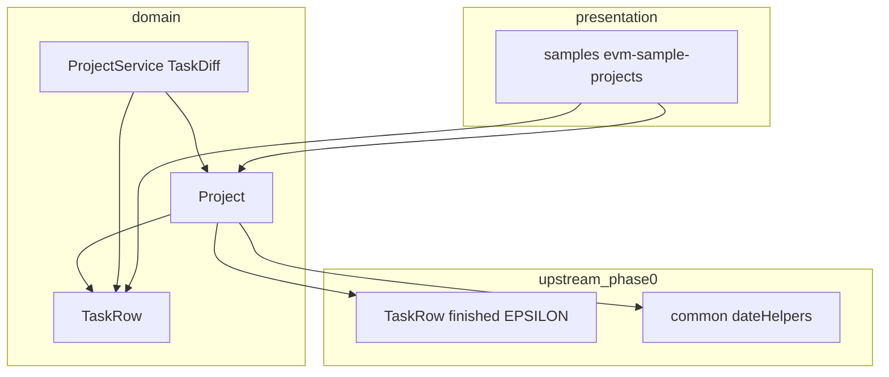
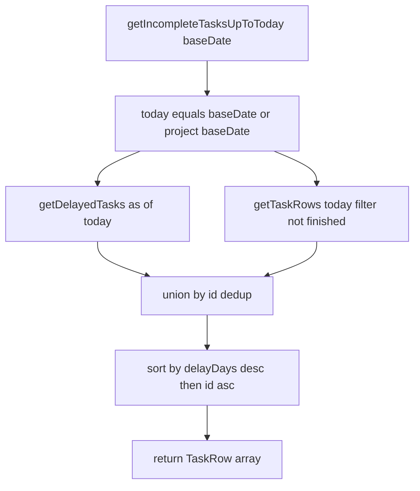
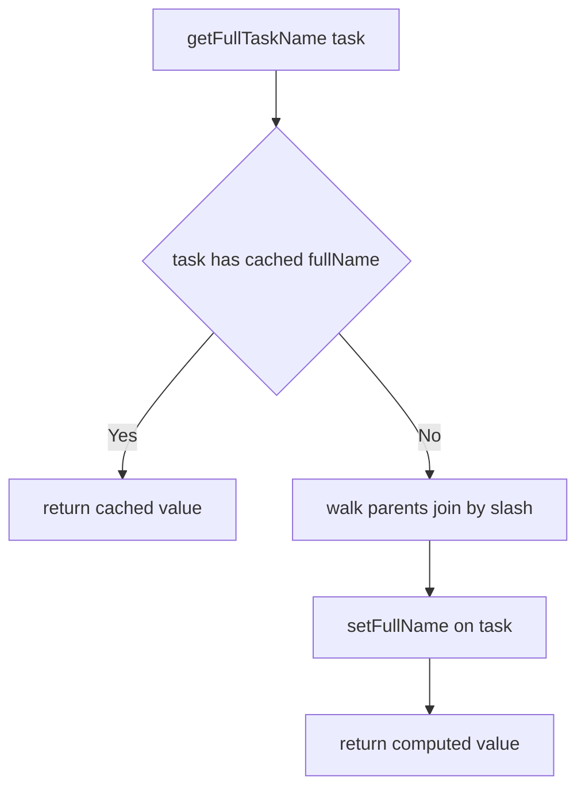

# 設計書: phase1-minor-issues-0.0.30

## 概要

**目的**: 本 spec は、既存部品の非破壊拡張で実現できる軽微 Issue 5 件（#166/#138/#153/#165/#160）を一括実装し、v0.0.30 としてリリースする。いずれもプロパティ追加・新メソッド追加・サンプル追加に閉じ、既存公開 API のシグネチャ・戻り値を変えない。

**ユーザー**: ライブラリ利用側（masatomix/task の evmtools スキル、evmtools-webui）が、グリーティング文字列・リスケ検知・フルパス名の高速取得・今日までの未完了タスク取得・今日のPV サンプルを利用する。

**インパクト**: 既存の `Project` / `ProjectService`(TaskDiff) / `TaskRow` に対する追加のみで、現行の振る舞いは変えない（Behavior Change なし）。#166 は既存コミット `e8c497b` の取り込み・照合で実現する。

### ゴール
- `Project.getNameWithGreeting()` を追加（既存コミット `e8c497b` の取り込み＋要件照合＋master 反映）
- `TaskDiff.isReschedule`（`deltaPV < 0` でリスケ検知、removed は false 固定）を追加
- `TaskRow` のフルパス名キャッシュを追加し、`Project.getFullTaskName()` を遅延メモ化
- `Project.getIncompleteTasksUpToToday(baseDate?)` を追加（遅延タスク＋当日タスクのマージ・重複排除・ソート）
- `samples/evm-sample-projects.ts` に「今日のPV」サンプルを追加し、`docs/examples` に反映
- 案件設計書・master 設計書の同期、release/0.0.30 準備、後方互換・検証ゲート通過

### 非ゴール
- 新規 EVM 指標（Earned Schedule 等、phase3 以降）
- task スキル独自ロジックの取り込み（phase2）
- `TaskDiff` の他フィールド拡張・差分アルゴリズム変更
- フルパス名を用いた検索/フィルタ機能（Backlog）
- Issue の棚卸し・クローズ（phase0 が担当）
- 暦日ヘルパー・`finished`（EPSILON）の新設（phase0 が提供済み、本 spec は利用のみ）

## 境界コミットメント

### この spec が担うもの
- `Project.getNameWithGreeting(): string` の追加（#166）
- `TaskDiff` 型の `isReschedule: boolean` 追加と `ProjectService` の差分生成 2 箇所（通常 / removed）での代入（#138）
- `TaskRow` の可変キャッシュフィールド `_fullName` と `setFullName()` / `get fullName()`、および `Project.getFullTaskName()` の遅延メモ化（#153）
- `Project.getIncompleteTasksUpToToday(baseDate?: Date): TaskRow[]` の追加（#165）
- `samples/evm-sample-projects.ts` への「今日のPV」サンプル追加と `docs/examples` の対応更新（#160）
- 上記に対応する案件設計書（`docs/specs/domain/features/`）・master 設計書（`docs/specs/domain/master/`）の同期、`package.json` / CHANGELOG のリリース準備

### 境界の外
- `getDelayedTasks()` / `getTaskRows()` / `getFullTaskName()` の**シグネチャ・戻り値**の変更（#165/#153 は追加・内部メモ化のみで契約不変）
- `TaskDiff` の `isReschedule` 以外のフィールド追加、`calculateProjectDiffs` の集計ロジック変更
- `finished` 判定・暦日ヘルパー・`calculateRecentSpi` 等 phase0 が所有するロジックの改変
- 集約型 `ProjectDiff` / `AssigneeDiff` への `isReschedule` 付与（個々タスクの概念のため対象外）
- CLI コマンド・Excel 入出力・要員計画（resource）への変更

### 許容する依存関係
- phase0-bugfix-0.0.29 が提供する許容誤差付き `TaskRow.finished`（`PROGRESS_RATE_EPSILON` ベース）に依存してよい（#165 の未完了判定）。
- phase0 が提供する暦日ヘルパー（`truncateToLocalDate` / `diffCalendarDays`）および `formatRelativeDaysNumber` に依存してよい（#165 の遅延日数）。本 spec で日付ヘルパーを新設しない。
- 既存の `Project.getDelayedTasks()` / `getTaskRows()` / `getTask()` / `toTaskRows()`、`TaskRow.pvTodayActual()` / `remainingDays()` / `workloadPerDay` を素材として利用してよい。
- 依存方向は `presentation → usecase → domain ← infrastructure`、`domain` は外部 I/O を持たない、を維持する。`common` の関数を `domain` から新規に呼び出す変更は行わない。
- 外部ライブラリ `excel-csv-read-write`（`date2Sn`）はサンプルでのみ利用してよい。

### 再検証トリガー
以下が生じた場合、下流（phase2 の AlertService 等）と利用側は統合を再確認する。
- `getIncompleteTasksUpToToday` の「未完了」定義・ソート順・戻り値型の変更
- `TaskDiff.isReschedule` の判定条件（`deltaPV < 0` / removed=false）の変更
- `getFullTaskName` の戻り値やキャッシュ整合性（同一 Project 内で id が一意である前提）の変更
- phase0 の `finished` 定義・暦日ヘルパー契約の変更（上流由来）

## アーキテクチャ

### 既存アーキテクチャ分析
- クリーンアーキテクチャ（`presentation → usecase → domain ← infrastructure`、`common` は共有ヘルパー）。5 件はいずれも `domain` 層（`Project` / `ProjectService` / `TaskRow`）とリポジトリ直下の `samples/` に閉じる。
- 尊重すべき境界: `domain` は外部 I/O を持たない。`TaskRow` の構築引数は readonly（キャッシュは可変フィールドで別扱い）。EVM 集計はリーフタスクのみ（`domain.md`）。
- 維持する統合ポイント: `getStatistics`、`getDelayedTasks`、`getTaskRows`、`getFullTaskName`、TaskDiff 型、サブパス export。
- 技術的負債: `getFullTaskName` の毎回ツリー走査（#153 で解消）。

### アーキテクチャパターン・境界マップ



**アーキテクチャ統合**:
- 選定パターン: 既存コンポーネントへの独立・非破壊追加。共通ファサードは新設しない（design-synthesis の Simplification）。
- ドメイン/機能の境界: #166/#153/#165 は `Project`、#138 は `ProjectService`(TaskDiff)、#153 のキャッシュ格納は `TaskRow`、#160 は `samples`。#166/#153/#165 は同一ファイル `src/domain/Project.ts` を変更するが、いずれも別メソッドの追加のみ（#153 は既存 `getFullTaskName` の内部メモ化）で論理的な重なりはない。Issue 単位の feature ブランチ分離により、同一ファイルでも衝突リスクは低い。責務の重ならない #138/#160 は完全に独立して並列実装できる。
- 維持する既存パターン: リーフのみ集計、readonly 構築引数、`getStatistics` の戻り値契約、pino ロガー。
- 新規コンポーネントの根拠: いずれも既存クラスへのメソッド/プロパティ追加であり、新規クラスは作らない。
- Steering との整合: `structure.md`（domain 層の責務分割）、`domain.md`（finished/isOverdueAt、実行PV、リーフ集計）、`master-spec-sync.md`（master 反映必須）。

### 依存方向の制約
- `TaskRow` に導入する可変キャッシュ（`_fullName`）は `domain` 内に閉じ、外部依存を増やさない。書き込みは `Project.getFullTaskName()` からのみ行い、`TaskService` へフルパス算出責務を漏らさない。
- #165 の遅延日数計算は phase0 の `formatRelativeDaysNumber`（`common`）に一本化し、`Project` から新たな `common` 関数呼び出しを増やさない（`getDelayedTasks` が既に利用している経路を再利用）。

### 技術スタック

| レイヤー | 採用技術 / バージョン | この機能での役割 | 備考 |
|----------|----------------------|------------------|------|
| Backend / Services | TypeScript 5.8（strict, CommonJS） | `Project` / `ProjectService` / `TaskRow` へのメソッド・プロパティ追加 | `any` 禁止 |
| Samples / CLI | ts-node（`npx ts-node`） | 「今日のPV」サンプル実行 | Jest 対象外。実行完了で検証 |
| Infrastructure / Runtime | Node.js 20/22, Jest 30 + ts-jest | ユニット/統合テスト・ビルド | CI で TZ=Asia/Tokyo / UTC の二重実行（phase0 導入分を継承） |

## ファイル構成計画

### 変更ファイル
- `src/domain/Project.ts` — (#166) `getNameWithGreeting()` 追加。(#153) `getFullTaskName()` を遅延メモ化（キャッシュ有無で分岐）。(#165) `getIncompleteTasksUpToToday(baseDate?)` 追加。
- `src/domain/ProjectService.ts` — (#138) `TaskDiff` 型に `readonly isReschedule: boolean` 追加。通常 diff 生成（116 付近）に `isReschedule: deltaPV !== undefined && deltaPV < 0`、removed diff 生成（176 付近）に `isReschedule: false` を追加。
- `src/usecase/__tests__/pbevm-diff-usecase.test.ts` — (#138) `createTaskDiff` ヘルパー内の `const base: TaskDiff = {...}`（33 行付近、キャストなしの完全リテラル）に `isReschedule: false` を追加。`isReschedule` を非オプショナルにすると本リテラルが型エラーになるため、本体 2 箇所と合わせて **TaskDiff 構築サイトは計 3 箇所** となる。
- `src/domain/TaskRow.ts` — (#153) 可変フィールド `private _fullName?: string`、`setFullName(name: string): void`、`get fullName(): string | undefined` を追加。
- `samples/evm-sample-projects.ts` — (#160) 「今日のPV」（計画PV vs `pvTodayActual`）出力関数を追加し、メイン実行から呼ぶ。

### 新規テストファイル
- `src/domain/__tests__/Project.nameWithGreeting.test.ts` — (#166) TC-01〜TC-04（既存コミット `e8c497b` のテストを取り込む）。
- `src/domain/__tests__/ProjectService.isReschedule.test.ts` — (#138) `isReschedule` の真偽・removed 固定・後方互換。
- `src/domain/__tests__/TaskRow.fullName.test.ts` — (#153) `setFullName`/`fullName` の格納・取得。
- `src/domain/__tests__/Project.fullNameCache.test.ts`（または既存 `Project` テストへ追記） — (#153) `getFullTaskName` のメモ化・結果不変。
- `src/domain/__tests__/Project.incompleteTasksUpToToday.test.ts` — (#165) マージ・重複排除・除外・ソート・基準日引数。

### 改訂ドキュメント
- `docs/specs/domain/features/Project.nameWithGreeting.spec.md`（#166、既存コミット由来を取り込み・照合）
- `docs/specs/domain/features/ProjectService.task-diff-reschedule.spec.md`（#138、新設）
- `docs/specs/domain/features/TaskRow.fullNameCache.spec.md`（#153、新設）
- `docs/specs/domain/features/Project.incompleteTasksUpToToday.spec.md`（#165、新設）
- `docs/specs/domain/features/Samples.pv-today.spec.md`（#160、新設。サンプル掲載の受入基準とトレーサビリティ）
- `docs/specs/domain/master/Project.spec.md`（#166/#153/#165 のメソッド仕様・テストシナリオ・変更履歴）
- `docs/specs/domain/master/ProjectService.spec.md`（#138 の TaskDiff 仕様・変更履歴）
- `docs/specs/domain/master/TaskRow.spec.md`（#153 の fullName キャッシュ・変更履歴）
- `docs/examples/README.md` または `docs/examples/02-project-statistics.md`（#160 のサンプル参照）
- `package.json`（0.0.30）、`CHANGELOG`（5 件の追加を追記）

> 各ファイルは単一責務。5 件は触れるファイルが重ならないため、feature ブランチを分けて並行編集できる。契約は下記「コンポーネント・インターフェース」で定義する。

## システムフロー

### #165 今日までの未完了タスク取得フロー



- 「今日」は引数 `baseDate` 指定時はそれを、未指定時は `Project.baseDate` を用いる（要件 4.5）。
- `getDelayedTasks()` は既に未完了・leaf・遅延日数降順を満たす。`getTaskRows(today)` 側は当日稼働の leaf を返すため `!finished` で未完了に絞る（要件 4.2）。
- 重複は id で排除（同一タスクが遅延かつ当日稼働のケース）。ソートは遅延日数降順・id 昇順（要件 4.4）。

### #153 フルパス名キャッシュフロー



- 初回のみツリー走査し `setFullName` で書き込む。2 回目以降はキャッシュ返却（要件 3.1）。算出結果は従来と同一（要件 3.2）。

## 要件トレーサビリティ

| 要件 | 概要 | コンポーネント | インターフェース | フロー |
|------|------|----------------|------------------|--------|
| 1.1〜1.4 | グリーティング文字列 | Project | `getNameWithGreeting` | — |
| 2.1〜2.4 | リスケ検知 | ProjectService(TaskDiff) | `TaskDiff.isReschedule` | — |
| 3.1〜3.4 | フルパス名キャッシュ | Project, TaskRow | `getFullTaskName`, `TaskRow.setFullName/fullName` | フルパス名キャッシュフロー |
| 4.1〜4.6 | 今日までの未完了タスク | Project | `getIncompleteTasksUpToToday` | 今日までの未完了タスク取得フロー |
| 5.1〜5.4 | 今日のPV サンプル | Samples | `evm-sample-projects` 出力関数 | — |
| 6.1〜6.3 | 設計書同期・トレーサビリティ | docs | feature/master spec | — |
| 7.1〜7.4 | リリース準備 | package.json, CHANGELOG | 検証ゲート・後方互換 | — |

## コンポーネント・インターフェース

| コンポーネント | ドメイン/レイヤー | 目的 | 要件カバレッジ | 主な依存（P0/P1） | 契約 |
|----------------|--------------------|------|----------------|---------------------|------|
| Project | domain | greeting / fullName メモ化 / 未完了タスク集約 | 1, 3, 4 | TaskRow (P0), phase0 finished (P0), formatRelativeDaysNumber (P1), getDelayedTasks/getTaskRows (P0) | Service |
| ProjectService(TaskDiff) | domain | リスケ検知プロパティ | 2 | deltaPV 算出 (P0) | Service |
| TaskRow | domain | フルパス名キャッシュ格納 | 3 | なし | State |
| Samples | samples | 今日のPV デモ | 5 | TaskRow.pvTodayActual / workloadPerDay (P0) | Batch |

### domain レイヤー

#### Project（`src/domain/Project.ts`）

| 項目 | 内容 |
|------|------|
| 目的 | greeting 文字列・フルパス名メモ化・今日までの未完了タスク取得を提供する |
| 要件 | 1.1〜1.4, 3.1〜3.4, 4.1〜4.6 |

**責務と制約**
- `getNameWithGreeting` は副作用なし。`name` が undefined/空文字でも ` Hello World.` を返す。
- `getFullTaskName` は初回のみ走査し `TaskRow` にキャッシュを書き込む。戻り値は従来と同一（親名を "/" 連結）。
- `getIncompleteTasksUpToToday` は leaf・未完了のみを、遅延タスク＋当日タスクのマージ・id 重複排除・遅延日数降順/id 昇順で返す。既存メソッドの契約は変えない。

**契約**: Service [x]

##### サービスインターフェース
```typescript
// #166: プロジェクト名 + " Hello World."（name 未設定時は先頭スペース）
getNameWithGreeting(): string

// #153: 初回のみツリー走査し TaskRow にキャッシュ。2回目以降はキャッシュ返却（戻り値は従来と同一）
getFullTaskName(task?: TaskRow): string

// #165: 今日時点の遅延タスク + 当日の未完了タスクをマージ・重複排除・ソートした leaf 配列
// baseDate 未指定時は this.baseDate を「今日」とする
getIncompleteTasksUpToToday(baseDate?: Date): TaskRow[]
```
- `getNameWithGreeting` 事前条件: なし。事後条件: `` `${name ?? ''} Hello World.` ``。不変条件: `name` を変更しない（要件 1.4）。
- `getFullTaskName` 事前条件: `task` は本 Project の `toTaskRows()` 由来。事後条件: キャッシュ有無に依らず同一文字列（要件 3.2）。不変条件: 2 回目以降は再走査しない（要件 3.1）。
- `getIncompleteTasksUpToToday` 事前条件: `baseDate` は有効な Date または未指定。事後条件:
  - 遅延タスク（`getDelayedTasks` 相当・as of today）と当日タスク（`getTaskRows(today)` の `!finished`）を union（要件 4.1）
  - `finished === true` を除外（要件 4.2）、非 leaf を除外（要件 4.3）
  - 遅延日数降順・id 昇順でソート（要件 4.4）
  - `baseDate` 未指定時は `this.baseDate` を today とする（要件 4.5）
- 不変条件: `getDelayedTasks` / `getTaskRows` のシグネチャ・戻り値は不変（要件 4.6）。

**実装メモ**
- 統合: #165 は `getDelayedTasks()`（既に遅延日数降順・leaf・未完了）を基盤に、`getTaskRows(today).filter(t => !t.finished)` を union する。遅延日数は `getDelayedTasks` と同じ `formatRelativeDaysNumber(baseDate, endDate)` 由来で算出し降順。`baseDate` を引数対応させる際、`getDelayedTasks` は `this.baseDate` 固定のため、当日基準を引数で受ける実装（内部で today を明示的に用いる）に揃える。
- バリデーション: 重複排除は `Map<number, TaskRow>` を id キーで構築。
- リスク: `getDelayedTasks` の today が `this.baseDate` 固定である点。引数 `baseDate` を渡すケースでは、遅延判定も同じ today で行う必要がある（`getDelayedTasks` を直接使うと today がずれる可能性）。実装時、遅延集合も today 基準で算出する（`this.baseDate === baseDate` の通常運用では差異なし。引数指定時は today に統一）。

#### ProjectService / TaskDiff（`src/domain/ProjectService.ts`）

| 項目 | 内容 |
|------|------|
| 目的 | TaskDiff にリスケ検知プロパティを追加する |
| 要件 | 2.1〜2.4 |

**責務と制約**
- `isReschedule` は個々タスクの差分概念であり `TaskDiff` にのみ追加する（`ProjectDiff`/`AssigneeDiff` には付与しない）。
- 判定は `deltaPV !== undefined && deltaPV < 0`。removed タスクは `deltaPV` が負値になりうるため `false` 固定。
- `isReschedule` を非オプショナルにするため、`TaskDiff` を完全リテラルで構築する全箇所（本体 2 箇所＋既存テストヘルパー 1 箇所＝計 3 箇所）で必ず値を設定する。設定漏れは型エラーとなる。

**契約**: Service [x]

##### サービスインターフェース
```typescript
export type TaskDiff = {
  // ...既存フィールド...
  readonly isReschedule: boolean // deltaPV<0 でリスケ検知。removed は false 固定
} & TaskDiffBase
```
- 事後条件（通常 diff）: `deltaPV !== undefined && deltaPV < 0 → true`、それ以外 → `false`（要件 2.1, 2.2）。
- 事後条件（removed diff）: 常に `false`（要件 2.3）。
- 不変条件: 既存 TaskDiff プロパティ・集計（ProjectDiff/AssigneeDiff）の後方互換（要件 2.4）。

**実装メモ**
- 統合: TaskDiff 構築サイトは計 3 箇所。(1) 通常 diff の push（`ProjectService.ts` 116 付近）に `deltaPV !== undefined && deltaPV < 0`、(2) removed diff の push（176 付近）に `false` 固定、(3) 既存テストヘルパー `src/usecase/__tests__/pbevm-diff-usecase.test.ts` の `base` リテラル（33 付近）に `false`。`deltaPV` は本体側で算出済み変数を再利用。
- バリデーション: `isReschedule` は非オプショナル `boolean`。型追加で既存テスト（とくに usecase テストヘルパー）が型エラーにならないよう、上記 3 箇所すべてで必ず値を設定する。
- リスク: removed 分岐で式をそのまま流用すると誤検知（`delta(undefined, prevPV)` が負）。`false` 固定で回避。テストヘルパーの構築サイトを見落とすとコンパイルエラーになる。

#### TaskRow（`src/domain/TaskRow.ts`）

| 項目 | 内容 |
|------|------|
| 目的 | フルパス名のキャッシュを格納する |
| 要件 | 3.1, 3.2 |

**責務と制約**
- `_fullName` は可変フィールド（readonly 構築引数とは別）。書き込みは `setFullName` 経由。
- キャッシュの算出責務は持たない（`Project.getFullTaskName` が算出して書き込む）。

**契約**: State [x]

##### 状態管理
```typescript
private _fullName?: string
setFullName(fullName: string): void  // キャッシュへ書き込み
get fullName(): string | undefined   // 未設定時は undefined
```
- 状態モデル: 未設定（undefined）→ 設定済み（string）の一方向。
- 永続化と一貫性: インメモリのみ。`Project` 単位で `toTaskRows()` が生成する `TaskRow` に紐づく。
- 並行性戦略: 単一スレッド前提、特別な制御は不要。

**実装メモ**
- 統合: `Project.getFullTaskName` が「キャッシュあれば返す／なければ算出して `setFullName`」を行う。
- バリデーション: `fullName` は文字列またはキャッシュ未設定時 undefined。
- リスク: 同一 `TaskRow` インスタンスが別 Project 文脈で共有されないことが前提（現状 `toTaskRows()` は Project ごとに生成）。

### samples レイヤー

#### Samples（`samples/evm-sample-projects.ts`）

| 項目 | 内容 |
|------|------|
| 目的 | 計画PV と実行PV（今日のPV）の比較サンプルを掲載する |
| 要件 | 5.1, 5.2, 5.3 |

**契約**: Batch [x]
- トリガー: `npx ts-node samples/evm-sample-projects.ts`。
- 入力/バリデーション: 既存の 3 サンプルプロジェクトを流用。各 leaf タスクの計画PV（`workloadPerDay`）と実行PV（`pvTodayActual(baseDate)`）を算出。
- 出力/出力先: 標準出力に表形式で「id / name / 残日数 / 計画PV / 実行PV / 状態（遅延圧・前倒し）」を出力（要件 5.1, 5.2）。
- 冪等性: 副作用なし。実行完了で観測（要件 5.3）。

## エラー処理

### エラー処理戦略
- いずれも計算不能は例外ではなく既存方針（`undefined`/`0`/空配列）で表現する。
- `getNameWithGreeting` は `name` undefined を空文字にフォールバック。
- `getIncompleteTasksUpToToday` は該当なしで空配列を返す（例外を投げない）。
- `pvTodayActual` の undefined（残日数不明等）はサンプル表示で `-` 等にフォールバックし、実行を止めない。

### モニタリング
- 既存の pino ロガー方針を踏襲。新規のログ追加は行わない（`getFullTaskName` のホットパスにログを増やさない）。

## テスト戦略

### ユニットテスト
- `getNameWithGreeting`（#166）: 英字名 → `"SamplePJ Hello World."`、空文字 → `" Hello World."`、日本語名 → `"日本語PJ Hello World."`、呼び出し後も `name` 不変（要件 1.1〜1.4。既存コミット `e8c497b` の TC-01〜TC-04 を取り込む）。
- `TaskDiff.isReschedule`（#138）: `deltaPV < 0` → true、`deltaPV = 0`/正 → false、`deltaPV = undefined` → false、removed タスク → false 固定、既存差分集計が回帰しないこと（要件 2.1〜2.4）。
- `getFullTaskName` メモ化（#153）: 同一タスク 2 回呼び出しで結果が同一、2 回目は再走査しない（`getTask` 呼び出し回数の減少をスパイ等で観測）、ルートタスクは自名のみ、既存 `fullName` 利用箇所の結果不変（要件 3.1〜3.4）。`TaskRow.setFullName/fullName` の格納・取得（要件 3.2）。
- `getIncompleteTasksUpToToday`（#165）: 遅延のみ／当日のみ／遅延かつ当日（重複排除）、完了タスク除外、非 leaf 除外、遅延日数降順・id 昇順、`baseDate` 引数指定と未指定（`this.baseDate` 利用）（要件 4.1〜4.6）。

### 統合テスト
- サンプルスクリプト（#160）: `npx ts-node samples/evm-sample-projects.ts` がエラーなく完了し、「今日のPV」表が出力される（要件 5.1〜5.3）。
- 全体: `npm test` 全緑、`TZ=Asia/Tokyo` / `TZ=UTC` の両方で緑（phase0 導入の CI 二重実行を継承。#165 の遅延日数計算が TZ 非依存であることを担保）。

### 検証ゲート
- `npm run lint && npm run format && npm test && npm run build`（CI 同一、Node 20/22）＋ TZ 二重実行（要件 7.3）。後方互換（サブパス export・既存 API）を確認（要件 7.4）。

## 補足参照

### #166 の取り込み方針
- `git show e8c497b`（`origin/worktree-evmtools`）に `Project.getNameWithGreeting()`・テスト・設計書が揃う。cherry-pick 相当で取り込み、要件 1 と照合し、master（`Project.spec.md`）へ反映する。整形差分（import・Prettier）が混在するため、コンフリクト時は該当メソッドとテストのみを手動取り込みする。

### 案件設計書と master 設計書の同期（CLAUDE.md / master-spec-sync.md 準拠）
- 各 feature spec に AC-ID → TC-ID のトレーサビリティ表を grep 可能な形式で記載（要件 6.1）。
- feature 追加・改訂時に対応する master 設計書へメソッド仕様・テストシナリオ・変更履歴（バージョン更新）を反映（要件 6.2）。
