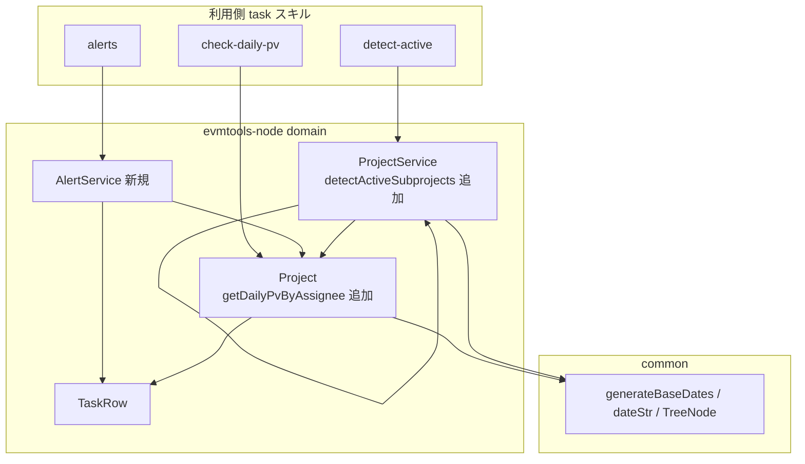
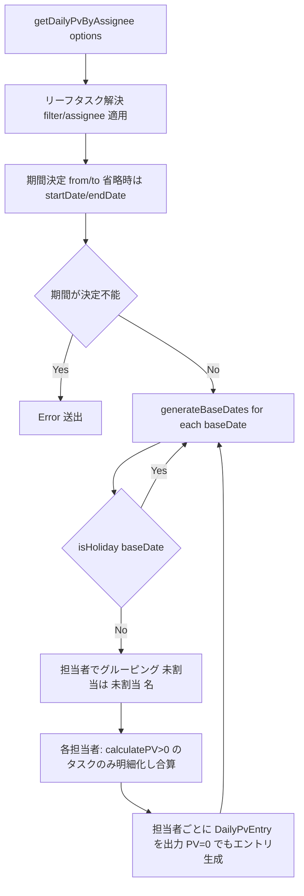
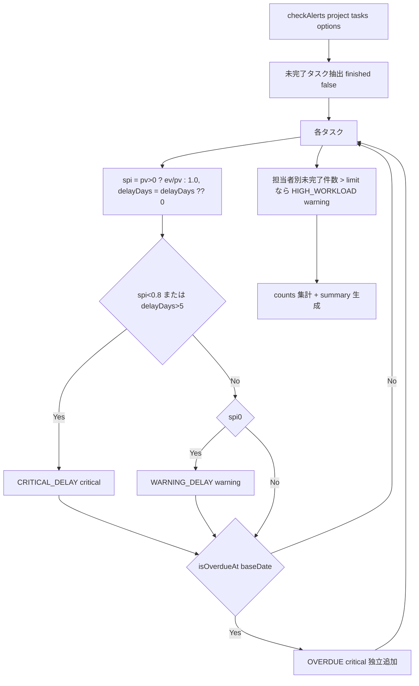
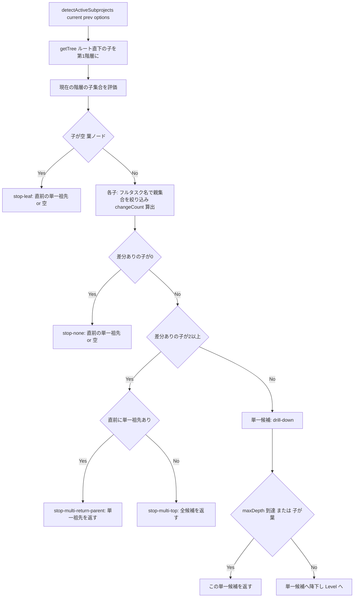

# 設計書: phase2-skill-integration-0.0.31

> **スコープ改訂（2026-07-04、ユーザー判断）**: steering「公開 API 追加の基準」の適用により、
> **要件2（AlertService）と要件3（detectActiveSubprojects）は取り下げ**。
> いずれも公開 API（getStatisticsByName / getDelayedTasks / calculateRecentSpi / getTree / calculateTaskDiffs）
> だけで利用側が合成可能であり、閾値・文言・「アクティブ」定義は利用側固有のポリシーのため。
> **要件1（getDailyPvByAssignee）のみ実施**。合成できない理由（基準4）: ライブラリ内部の同一 EVM 計算
> （_internalPvByNameLong 相当）をスキルが再実装しており、丸め・(未割当)・日付ラベルの細部乖離による
> **数値不一致リスクの解消（計算の単一ソース化）**。getStatistics({filter})（#393→0.0.25）と同一パターン。
> リリースは 0.0.31 単独ではなく **0.0.30（phase1 残置分と合流）** に変更。


## 概要

**目的**: 本 spec は、masatomix/task の evmtools スキルが独自実装している EVM 計算ロジック 3 本（日次PV担当者別集計 / アラート判定 / アクティブサブプロジェクト検出）を evmtools-node の**公開 API**として取り込み、v0.0.31 としてリリースする。これにより「計算はライブラリに集約し、WebUI・CLI・スキルで数値を一致させる」方針を前進させる。

**ユーザー**: ライブラリ利用側（task の evmtools スキル、evmtools-webui、CLI 利用者）が、日次PV負荷確認・異常アラート・差分サブプロジェクト特定のために本 API を利用する。

**インパクト**: 既存の非公開ロジック（`Project._internalPvByNameLong`）に対して、フィルタ・担当者絞り込み・タスク明細・PV=0 エントリ出力に対応した**新しい公開メソッド**を追加する。アラート判定は新規ドメインサービス、アクティブ検出は `ProjectService` の新規メソッドとして追加する。既存の公開 API・ゲッター・サブパス export はすべて非破壊で維持する（純粋な追加）。

### ゴール
- `Project.getDailyPvByAssignee(options?)` を公開 API 化し、スキルの `calculateDailyPvByAssignee` を数値一致で置換可能にする。
- 新規 `AlertService.checkAlerts(project, tasks, options?)` を追加し、スキルの `checkAlertsCore` を数値・文言一致で置換可能にする。
- `ProjectService.detectActiveSubprojects(current, prev, options?)` を追加し、スキルの `detectActiveSubprojects` を出力一致で置換可能にする。
- 3 機能の型を `evmtools-node/domain` から export し、`any` を使わない。
- `npm pack` → task リポジトリへの file: インストール → スキル 3 本の新 API 置換で**出力一致**を実証する。
- feature/master 設計書の作成・同期、v0.0.31 リリース準備、task リポジトリへの後続 Issue 起票。

### 非ゴール
- task スキル側コードの恒久的な書き換え（本 spec は数値一致の実証まで。撤去は task リポジトリの Issue）。
- WBS の Excel 書き出し（task#687）、日次PV マトリクスの Excel 装飾（プレゼン層。スキル側に残す）。
- 異常値の統計的検知（task#436 本格版）。閾値判定までが本 spec。
- コスト系 EVM、Earned Schedule（phase3/4）。
- 既存の集計経路（親PV=子リーフ合計方式）への転換。

## 境界コミットメント

### この spec が担うもの
- `Project` への `getDailyPvByAssignee(options?: DailyPvByAssigneeOptions): DailyPvEntry[]` の追加と、関連型（`DailyPvByAssigneeOptions` / `DailyPvEntry` / `DailyPvTaskDetail`）の定義・export。
- 新規 `src/domain/AlertService.ts`（`AlertService` クラスと `Alert` / `AlertsResult` / `AlertOptions` / `AlertType` / `AlertSeverity` / `AlertCounts` 型）の追加と `src/domain/index.ts` への export 追加。
- `ProjectService` への `detectActiveSubprojects(current, prev, options?)` の追加と関連型（`ActiveSubprojectsOptions` / `ActiveCandidate` / `DetectTraceStep` / `ActiveSubprojectsResult`）の定義・export。
- 3 機能のユニット/統合テスト（参照実装との数値・文言一致を含む）。
- feature 設計書（本 spec）と master 設計書（`AlertService.spec.md` 新設、`Project.spec.md` / `ProjectService.spec.md` 更新）の同期。
- v0.0.31 リリース準備（`package.json`・CHANGELOG）と、task リポジトリへの後続 Issue 起票。

### 境界の外
- スキル側 3 ファイルの恒久書き換え・削除（task リポジトリの Issue）。
- Excel 装飾・WBS 書き出し（プレゼン層）。
- `Project._internalPvByNameLong` / 既存ゲッターの実装変更（新メソッドは別経路として追加。既存は不変）。
- `ProjectService.calculateRecentSpi` / 日付ヘルパー / `calculateProjectDiffs` の**実装変更**（phase0 の成果物に依存するのみ）。
- 既存公開 API（サブパス export、`getStatistics`、`getDelayedTasks`、`calculateTaskDiffs` 等）のシグネチャ変更。

### 許容する依存関係
- phase0-bugfix-0.0.29 の成果物: `ProjectService.calculateRecentSpi`（ΔEV/ΔPV）、日付ヘルパー、`calculateProjectDiffs` の空入力デフォルト ProjectDiff（`detectActiveSubprojects` が空 diff 時に依存）。
- 既存の安定 API: `Project.getTree()`、`Project.getFullTaskName(task)`、`Project.filterTasks(options)`、`Project.isHoliday(date)`、`Project.toTaskRows()`、`Project.baseDate` / `startDate` / `endDate`、`Project._resolveTasks`（内部再利用）、`ProjectService.calculateTaskDiffs` / `calculateProjectDiffs`。
- `common`: `generateBaseDates`、`dateStr`、`TreeNode` 型。
- `TaskRow` の読み取り専用プロパティ: `isLeaf` / `assignee` / `name` / `id` / `pv` / `ev` / `delayDays` / `endDate` / `finished` / `calculatePV(baseDate)` / `isOverdueAt(baseDate)`。
- 依存方向は `presentation → usecase → domain ← infrastructure`、`domain/common` を維持。domain 層は外部 I/O を持たない。

### 再検証トリガー
以下が変わると、下流（phase4 Sカーブ）と利用側（task スキル）は統合を再確認する。
- `getDailyPvByAssignee` の戻り値形状（`DailyPvEntry` のフィールドや PV=0 エントリの出力条件）。
- `AlertService.checkAlerts` のアラート種別・重要度・閾値既定値・メッセージ文言・サマリ書式。
- `detectActiveSubprojects` の探索アルゴリズム（判定順序・changeCount 定義・トレースの `decision` 種別）。
- 参照実装（スキル 3 本）が更新され、数値一致のオラクルが変わった場合。

## アーキテクチャ

### 既存アーキテクチャ分析
- クリーンアーキテクチャ（`presentation → usecase → domain ← infrastructure`、`common` は全層から参照可能）。domain 層は外部 I/O を持たない。
- 尊重すべき境界: 集計・差分・遅延判定はすべて domain 層（`Project` / `ProjectService` / `TaskRow`）に閉じる。日付生成・整形は `common`。
- 維持する統合ポイント: サブパス export、`getStatistics` / `getDelayedTasks` オーバーロード、`calculateTaskDiffs` / `calculateProjectDiffs`、`getTree`。
- 解消する二重実装: スキル側 3 本（`calculateDailyPvByAssignee` / `checkAlertsCore` / `detectActiveSubprojects`）。これらをライブラリへ移植する。

### アーキテクチャパターン・境界マップ



**アーキテクチャ統合**:
- 選定パターン: 既存クリーンアーキテクチャを維持し、3 機能を**純粋な追加**として配置する。日次PV は集約ルート `Project` のメソッド、アラートは独立ドメインサービス、アクティブ検出は差分計算の所有者 `ProjectService` のメソッド。
- ドメイン/機能の境界: 集計 = `Project`、アラート判定 = `AlertService`、差分ベースの探索 = `ProjectService`。3 機能は相互独立（並行実装可能）。
- 維持する既存パターン: DTO↔Entity、オーバーロード、`_resolveTasks` によるリーフ限定、pino ロガー、サブパス export。
- 新規コンポーネントの根拠: `AlertService` はタスク横断の判定ロジックを持ち、`Project` にも `ProjectService` にも属さないため独立サービスとして新設する（`ProjectService` が差分の所有者であるのと同じ粒度）。
- Steering との整合: `structure.md`（domain は外部依存なし、`{接頭辞}{ドメイン名}` 命名）、`domain.md`（リーフのみ集計、SPI=ΣEV/ΣPV、遅延の二面性）、`tech.md`（strict / `any` 禁止）。

### 数値一致の設計原則（最重要）

本 spec の受け入れ条件は「スキル参照実装と出力が一致すること」である。したがって 3 機能は**参照実装のアルゴリズムを権威（オラクル）として忠実に再現**する。既存ライブラリヘルパー（`getDelayedTasks` / `getStatisticsByName` 等）による内部再利用は、**参照実装と同一結果を返す場合に限り**採用する。特にアラート判定では次の差異に注意し、参照実装のロジックを優先する（下記「build-vs-adopt」参照）:

- アラートの遅延日数はタスクの Excel 由来 `delayDays` を使う。`getDelayedTasks` の暦日計算（`formatRelativeDaysNumber`）とは定義が異なるため流用しない。
- アラートのタスクSPIは Excel 由来 `pv` / `ev` から算出する（`pv <= 0` は 1.0）。`calculatePV` ベースの統計とは異なるため流用しない。
- 担当過多は未完了タスク件数の単純カウントであり、`getStatisticsByName` のグルーピングとは目的が異なるため流用しない。

### 技術スタック

| レイヤー | 採用技術 / バージョン | この機能での役割 | 備考 |
|----------|----------------------|------------------|------|
| Backend / Services | TypeScript 5.8（strict, CommonJS） | ドメインロジック追加 | `any` 禁止・新規型は全て export |
| Data / Storage | excel-csv-read-write（`date2Sn` 等・間接） | PV 計算（`TaskRow.calculatePV` 経由） | 直接依存は増やさない |
| Infrastructure / Runtime | Node.js 20/22, Jest 30 + ts-jest | テスト・ビルド | CI で TZ 二重実行（phase0 導入済み） |
| 結合確認 | npm pack + file: 依存 | task スキルとの数値一致検証 | tgz を task リポジトリへ導入 |

## ファイル構成計画

### 変更ファイル
- `src/domain/Project.ts` — `getDailyPvByAssignee(options?)` メソッドと関連型（`DailyPvByAssigneeOptions` / `DailyPvEntry` / `DailyPvTaskDetail`）を追加。既存 `_internalPvByNameLong` およびゲッターは不変。`_resolveTasks` / `filterTasks` / `getFullTaskName` / `isHoliday` を再利用。
- `src/domain/ProjectService.ts` — `detectActiveSubprojects(current, prev, options?)` メソッドと関連型（`ActiveSubprojectsOptions` / `ActiveCandidate` / `DetectTraceStep` / `ActiveSubprojectsResult`）を追加。既存 `calculateTaskDiffs` / `calculateProjectDiffs` を再利用。
- `src/domain/index.ts` — `export * from './AlertService'` を追加（`Project` / `ProjectService` 由来の新規型は既存の `export *` で自動公開される）。
- `package.json` — バージョンを 0.0.31 に更新。
- CHANGELOG（既存の変更履歴ファイル） — 3 機能の追加を記載。

### 新規ファイル
- `src/domain/AlertService.ts` — `AlertService` クラスと関連型。参照実装 `checkAlertsCore` のアルゴリズムを移植。

### 新規テストファイル
- `src/domain/__tests__/Project.getDailyPvByAssignee.test.ts` — 休日スキップ・未割当・フィルタ・担当者絞り込み・期間補完・PV=0 エントリ・丸め・リーフ限定・参照実装一致。
- `src/domain/__tests__/AlertService.test.ts` — 4 種別の閾値境界・未完了限定・OVERDUE 独立性・担当過多・オプション上書き・counts/summary・メッセージ文言・参照実装一致。
- `src/domain/__tests__/ProjectService.detectActiveSubprojects.test.ts` — 単一掘り下げ・複数で親返却・depth=1 複数・葉/差分なし・maxDepth・changeCount 定義・トレース・参照実装一致。

### 改訂ドキュメント
- `docs/specs/domain/master/AlertService.spec.md` — 新設（master 設計書）。
- `docs/specs/domain/master/Project.spec.md` — `getDailyPvByAssignee` のメソッド仕様・テストシナリオ・変更履歴・トレーサビリティを追記。
- `docs/specs/domain/master/ProjectService.spec.md` — `detectActiveSubprojects` を追記。

> 各ファイルは単一責務。物理配置のみ本節で扱い、契約は「コンポーネント・インターフェース」で定義する。

## システムフロー

### 日次PV担当者別集計フロー



- PV=0 エントリを必ず出力する点が要（スキルの `buildGapRanges` が PV=0 の連続を検出するため）。
- 丸めは「各タスクPVを小数第3位で丸めて明細へ」「合算は未丸め値を合算し最後に小数第3位で丸める」の 2 段（参照実装準拠）。

### アラート判定フロー



- CRITICAL/WARNING は排他（else if）だが、OVERDUE は独立して**追加**され得る（同一タスクが CRITICAL と OVERDUE の 2 件を持ち得る）。参照実装準拠。

### アクティブサブプロジェクト検出フロー



- 各子の changeCount = その子のフルタスク名で部分一致フィルタしたタスク集合に対する `ProjectDiff` の `modifiedCount + addedCount + removedCount`（`calculateTaskDiffs` を一度計算し、子の対象ID集合で絞ってから `calculateProjectDiffs`）。

## 要件トレーサビリティ

| 要件 | 概要 | コンポーネント | インターフェース | フロー |
|------|------|----------------|------------------|--------|
| 1.1〜1.12 | 日次PV担当者別集計 | Project | `getDailyPvByAssignee` | 日次PV担当者別集計フロー |
| 2.1〜2.9 | アラート判定 | AlertService | `checkAlerts` | アラート判定フロー |
| 3.1〜3.9 | アクティブサブプロジェクト検出 | ProjectService | `detectActiveSubprojects` | アクティブ検出フロー |
| 4.1〜4.5 | 公開 API export・後方互換 | domain/index, Project, ProjectService, AlertService | export 群 | — |
| 5.1〜5.5 | スキル結合確認（数値一致） | 結合確認プロセス | npm pack + file: | 3 フロー全て |
| 6.1〜6.6 | リリース準備・設計書同期 | package.json, CHANGELOG, master specs | — | — |
| 7.1〜7.3 | task リポジトリ後続 Issue | GitHub（task リポジトリ） | gh issue create | — |

## コンポーネント・インターフェース

| コンポーネント | ドメイン/レイヤー | 目的 | 要件カバレッジ | 主な依存（P0/P1） | 契約 |
|----------------|--------------------|------|----------------|---------------------|------|
| Project.getDailyPvByAssignee | domain | 担当者×日のPV明細集計 | 1 | Project._resolveTasks/filterTasks (P0), common/generateBaseDates (P0), TaskRow.calculatePV (P0) | Service |
| AlertService | domain | タスク横断アラート判定 | 2, 4 | Project.baseDate/getFullTaskName (P0), TaskRow.pv/ev/delayDays/isOverdueAt (P0) | Service |
| ProjectService.detectActiveSubprojects | domain | 差分のあるサブツリー検出 | 3, 4 | Project.getTree/getFullTaskName (P0), calculateTaskDiffs/calculateProjectDiffs (P0, phase0 空 diff 依存) | Service |
| domain/index export | domain | 新規型の公開 | 4 | 上記 3 コンポーネント (P0) | Service |
| 結合確認プロセス | infra/release | 数値一致の実証 | 5, 6 | npm pack, task リポジトリ (P0) | Batch |

### domain レイヤー

#### Project.getDailyPvByAssignee（`src/domain/Project.ts`）

| 項目 | 内容 |
|------|------|
| 目的 | 担当者ごと・稼働日ごとの計画価値をタスク明細付きで集計する |
| 要件 | 1.1, 1.2, 1.3, 1.4, 1.5, 1.6, 1.7, 1.8, 1.9, 1.10, 1.11, 1.12 |

**責務と制約**
- リーフタスク（`isLeaf === true`）のみを対象にする。フィルタ・担当者絞り込みは `_resolveTasks` / `filterTasks` の既存機構を再利用する。
- 休日（`isHoliday`）はスキップする。未割当担当者は「(未割当)」に正規化する。
- 対象タスクを保有する担当者には、その稼働日に正のPVが無くても PV=0 のエントリを出力する（gap 集約のため）。
- 既存ゲッター（`pvByNameLong` 等）・`_internalPvByNameLong` は不変。

**契約**: Service [x]

##### サービスインターフェース
```typescript
/** 日次PV明細のタスク項目 */
export interface DailyPvTaskDetail {
  name: string       // タスク名（未設定時は空文字）
  fullName: string   // getFullTaskName(task)
  pv: number         // このタスクの計算PV（小数第3位で丸め）
}

/** 担当者×日ごとの日次PVエントリ */
export interface DailyPvEntry {
  assignee: string             // 未割当は '(未割当)'
  date: string                 // dateStr(baseDate) 'YYYY/MM/DD'（ja-JP）
  pv: number                   // 明細PVの合算（小数第3位で丸め）
  taskCount: number            // 明細タスク数（pv>0 のもの）
  tasks: DailyPvTaskDetail[]
}

/** 日次PV集計オプション */
export interface DailyPvByAssigneeOptions extends TaskFilterOptions {
  assignee?: string  // 特定担当者のみ
  from?: Date        // 集計開始日（省略時 startDate）
  to?: Date          // 集計終了日（省略時 endDate）
}

// Project のメソッド
getDailyPvByAssignee(options?: DailyPvByAssigneeOptions): DailyPvEntry[]
```
- 事前条件: `options.filter` は `filterTasks` に委譲。期間は `from ?? startDate` / `to ?? endDate`。
- 事後条件:
  - リーフタスクを解決 → `filter` 部分一致 → `assignee` 完全一致で絞り込む（要件 1.7, 1.8, 1.11）。
  - `from`/`to` のいずれも決定できない場合は Error を送出（要件 1.10）。
  - `generateBaseDates(from, to)` の各基準日で `isHoliday` の日をスキップ（要件 1.2）。
  - 担当者ごとにグルーピング（`assignee ?? '(未割当)'`、要件 1.3）。各タスクの `calculatePV(baseDate)` が `undefined` でなく 0 超のもののみ明細化し、`{ name: task.name ?? '', fullName: getFullTaskName(task), pv: round3(pv) }` を積む（要件 1.4）。
  - `entry.pv = round3(Σ 未丸めPV)`、`taskCount = 明細数`、担当者が対象タスクを持つ限りエントリを出力（PV=0 でも、要件 1.5, 1.6）。
- 不変条件: 既存の PV 系ゲッター・シグネチャは不変（要件 1.12）。`round3(x) = Math.round(x * 1000) / 1000`。

**実装メモ**
- 統合: グルーピングは `tidy` ではなく参照実装同様の `Map<string, TaskRow[]>` で行い、PV=0 エントリ出力・明細付き・丸め順序を参照実装と一致させる（`_internalPvByNameLong` の tidy 経路は PV=0 エントリと明細を持てないため流用しない）。
- バリデーション: `calculatePV` の戻り値 `undefined` と `0` を明細から除外（`pv !== undefined && pv > 0`）。
- リスク: 丸め順序（明細は個別丸め、合算は最後に丸め）を取り違えると数値不一致になる。テストで固定する。

#### AlertService（`src/domain/AlertService.ts`）

| 項目 | 内容 |
|------|------|
| 目的 | 未完了タスク一覧から遅延・期限超過・担当過多アラートを重要度付きで検出する |
| 要件 | 2.1, 2.2, 2.3, 2.4, 2.5, 2.6, 2.7, 2.8, 2.9, 4.1, 4.5 |

**責務と制約**
- 未完了タスク（`finished === false`）のみ対象。
- タスクSPI = `pv && pv > 0 ? (ev ?? 0) / pv : 1.0`（Excel 由来 PV/EV）。遅延日数 = `delayDays ?? 0`（Excel 由来）。
- CRITICAL_DELAY と WARNING_DELAY は排他（else if）。OVERDUE は独立追加。HIGH_WORKLOAD は担当者別未完了件数。
- メッセージ文言・サマリ書式・counts を参照実装と一致させる。

**契約**: Service [x]

##### サービスインターフェース
```typescript
export type AlertType = 'CRITICAL_DELAY' | 'WARNING_DELAY' | 'OVERDUE' | 'HIGH_WORKLOAD'
export type AlertSeverity = 'critical' | 'warning' | 'info'

export interface Alert {
  type: AlertType
  severity: AlertSeverity
  target: string       // タスク名（未設定時 `タスク#${id}`）または担当者名
  targetId?: number    // タスク単位アラートのタスクID
  message: string
  task?: TaskRow       // タスク単位アラートの発生元タスク（任意・利便のため）
  assignee?: string    // HIGH_WORKLOAD の担当者（任意）
}

export interface AlertCounts {
  critical: number
  warning: number
  info: number
}

export interface AlertsResult {
  alerts: Alert[]
  counts: AlertCounts
  summary: string
}

export interface AlertOptions {
  spiThreshold?: number          // WARNING 判定のSPI閾値（既定 0.9）
  criticalSpiThreshold?: number  // CRITICAL 判定のSPI閾値（既定 0.8）
  criticalDelayDays?: number     // CRITICAL 判定の遅延日数（既定 5）
  workloadLimit?: number         // 担当過多の上限件数（既定 10）
}

export class AlertService {
  checkAlerts(project: Project, tasks: TaskRow[], options?: AlertOptions): AlertsResult
}
```
- 事前条件: `tasks` はフィルタ済みのリーフタスクを想定（呼び出し側で `filterTasks` 済み）。`project` は `baseDate` と `getFullTaskName` の提供元。
- 事後条件:
  - `incomplete = tasks.filter(t => !t.finished)`（要件 2.1）。
  - 各 `task`: `spi = task.pv && task.pv > 0 ? (task.ev ?? 0) / task.pv : 1.0`、`delayDays = task.delayDays ?? 0`。
    - `spi < criticalSpiThreshold(0.8) || delayDays > criticalDelayDays(5)` → CRITICAL_DELAY / critical、message `重大な遅延（SPI=${spi.toFixed(2)}, 遅延=${delayDays}日）`（要件 2.2, 2.8）。
    - else if `spi < spiThreshold(0.9) || delayDays > 0` → WARNING_DELAY / warning、message `遅延の兆候（SPI=${spi.toFixed(2)}, 遅延=${delayDays}日）`（要件 2.3, 2.8）。
    - `task.isOverdueAt(project.baseDate)` が真 → OVERDUE / critical を独立追加、message `期限超過（予定終了日: ${task.endDate ? formatIsoDate(task.endDate) : '不明'}）`（要件 2.4）。
    - `target = task.name ?? `タスク#${task.id}``、`targetId = task.id`（要件 2.6）。
  - HIGH_WORKLOAD: 未完了タスクを担当者（`assignee ?? '未割当'`）で件数集計し、`count > workloadLimit(10)` の担当者に warning、message `担当タスク過多（${count}件）`、`target = assignee`（要件 2.5, 2.8）。
  - `counts` = severity 別件数、`summary` = 件数>0 なら `アラート${n}件（Critical: ${c}, Warning: ${w}, Info: ${i}）`、0 なら `アラートなし`（要件 2.7）。
- 不変条件: 参照実装 `checkAlertsCore` と同一入力で `alerts`（種別/重要度/target/targetId/message）・`counts`・`summary` が一致（要件 2.9）。`any` 不使用（要件 4.5）。

**実装メモ**
- 統合: `formatIsoDate(date)` は参照実装の `date.toISOString().split('T')[0]` と同一文字列を返す整形とする（OVERDUE メッセージの文言一致のため。既存 `dateStr` が同一結果を返すことを確認できれば `dateStr` に統一してよい。テストで文言を固定する）。
- バリデーション: `spi.toFixed(2)` の丸めと `delayDays` の整数表示を参照実装と一致させる。
- リスク: `getDelayedTasks` / `getStatisticsByName` は遅延定義・グルーピングが異なり数値がずれるため流用しない（「数値一致の設計原則」参照）。

#### ProjectService.detectActiveSubprojects（`src/domain/ProjectService.ts`）

| 項目 | 内容 |
|------|------|
| 目的 | 2 スナップショット間で差分のあるサブツリーのルートを再帰探索で特定する |
| 要件 | 3.1, 3.2, 3.3, 3.4, 3.5, 3.6, 3.7, 3.8, 3.9, 4.1, 4.5 |

**責務と制約**
- `current.getTree()` のルート直下の子を第 1 階層とし、単一候補で掘り下げ・複数候補で親返却/トップ返却・葉/差分なしで単一祖先返却/空、の判定を参照実装と一致させる。
- 各子の changeCount は、子のフルタスク名で部分一致フィルタしたタスク集合に対する `ProjectDiff` の `modifiedCount + addedCount + removedCount`。
- トレース（各階層の候補と decision）を返す。

**契約**: Service [x]

##### サービスインターフェース
```typescript
export interface ActiveSubprojectsOptions {
  maxDepth?: number  // 最大掘り下げ深さ（省略時 Infinity）
}

export interface ActiveCandidate {
  name: string
  path: string        // 'parent/child' 形式
  changeCount: number
}

export type DetectDecision =
  | 'drill-down'
  | 'stop-multi-return-parent'
  | 'stop-multi-top'
  | 'stop-leaf'
  | 'stop-none'

export interface DetectTraceStep {
  depth: number
  parentPath: string
  candidates: ActiveCandidate[]
  decision: DetectDecision
}

export interface ActiveSubprojectsResult {
  names: string[]
  paths: string[]
  trace: DetectTraceStep[]
}

// ProjectService のメソッド
detectActiveSubprojects(
  current: Project,
  prev: Project,
  options?: ActiveSubprojectsOptions
): ActiveSubprojectsResult
```
- 事前条件: `current` / `prev` は比較可能なスナップショット（同一プロジェクトの異なる基準日）。
- 事後条件（参照実装 `detect-active.ts` 準拠、要件 3.1〜3.8）:
  - 第 1 階層 = 全ルートの子を平坦化した配列。親のタスク集合は初期状態で `current`/`prev` のリーフ全体。
  - 各子: 親集合をフルタスク名（`getFullTaskName` 部分一致）で子名にフィルタ。current/prev とも空ならスキップ。`calculateTaskDiffs(current, prev)` を対象ID集合で絞って `calculateProjectDiffs` し、`changeCount = modifiedCount + addedCount + removedCount`。`changeCount > 0` を候補とする（要件 3.7）。
  - 候補 0 → `stop-none`（直前単一祖先 or 空、要件 3.5）。候補 2 以上 → 直前単一祖先ありなら `stop-multi-return-parent`（要件 3.3）、無ければ `stop-multi-top`（全候補、要件 3.4）。候補 1 → `drill-down`。`maxDepth` 到達 or 子が葉なら `stop-leaf` 相当でその単一候補を返す（要件 3.6）。子が空（葉）に降下したら `stop-leaf`（要件 3.5）。
  - 結果は `names` / `paths` / `trace`（要件 3.8）。
- 不変条件: 参照実装と `names` / `paths` / `trace` が一致（要件 3.9）。`any` 不使用（要件 4.5）。phase0 の `calculateProjectDiffs` 空入力デフォルト（changeCount=0）に依存。

**実装メモ**
- 統合: 参照実装は子ごとに `compareProjectsCore`（内部で `calculateTaskDiffs` を都度実行）を呼ぶが、ライブラリでは `calculateTaskDiffs(current, prev)` を一度だけ計算し、子の対象ID集合（current/prev の絞り込み結果の id 和集合）で `filter` してから `calculateProjectDiffs` することで同一の changeCount を得つつ効率化する。
- バリデーション: フルタスク名フィルタは `Project.getFullTaskName` を使い、スキルの `filterTasks`（fullName 部分一致）と同一意味にする。
- リスク: 探索の分岐（single/multi/leaf/none）と decision 名を取り違えるとトレース不一致になる。参照実装の while ループ構造を保持する。

### 結合確認プロセス（infra/release）

| 項目 | 内容 |
|------|------|
| 目的 | 3 機能がスキル参照実装と数値・出力一致することを実データで実証する |
| 要件 | 5.1, 5.2, 5.3, 5.4, 5.5 |

**契約**: Batch [x]
- トリガー: 3 機能の実装・テスト完了後、リリース前。
- 入力/バリデーション: `npm pack` で tgz 生成 → task リポジトリへ `file:` 依存としてインストール → スキルの `check-daily-pv` / `alerts` / `detect-active` を新公開 API へ一時的に置き換え、同一 Excel・同一オプションで実行。
- 出力/出力先: スキルの現行実装出力と新 API 出力を突き合わせ、日次PV（過負荷・gap・サマリ）／アラート（種別・重要度・target・counts・summary）／アクティブ検出（names・paths・trace）が一致することを確認。
- 冪等性とリカバリ: スキル側の一時置き換えは検証用でコミットしない（恒久書き換えは task リポジトリの Issue）。共通検証ゲート（lint/format/test/build）を Node 20/22・TZ=Asia/Tokyo/UTC で通過（要件 5.5）。

## エラー処理

### エラー処理戦略
- `getDailyPvByAssignee`: 期間が決定できない場合のみ Error を送出（参照 CLI と同様のメッセージ意図）。それ以外は空配列や PV=0 エントリで表現する。
- `checkAlerts`: 例外を投げず、対象が無ければ空 `alerts` と `アラートなし` サマリを返す。
- `detectActiveSubprojects`: 差分が無ければ空 `names`/`paths` と `stop-*` トレースを返す（例外なし）。

### モニタリング
- 既存 pino ロガー方針を踏襲。新規に警告を追加する必要はない（純粋な追加 API）。

## テスト戦略

### ユニットテスト
- **getDailyPvByAssignee**: (1) 休日基準日がスキップされる、(2) 未割当タスクが「(未割当)」に集約、(3) `filter` 部分一致で対象限定、(4) `assignee` 絞り込み、(5) `from`/`to` 省略時に startDate/endDate 補完・両端不明で Error、(6) PV>0 タスクのみ明細化・明細PVと合算の丸め（小数第3位・丸め順序）、(7) 正PVが無い担当者でも PV=0 エントリ出力（gap 検出用）、(8) リーフ限定、(9) 既存ゲッターの回帰なし。
- **AlertService**: (1) 未完了限定、(2) CRITICAL 境界（spi<0.8 / delayDays>5 / pv<=0 で spi=1.0）、(3) WARNING 境界（spi<0.9 / delayDays>0、CRITICAL と排他）、(4) OVERDUE 独立追加（同一タスクで CRITICAL+OVERDUE の 2 件）、(5) HIGH_WORKLOAD（count>10、未割当は「未割当」）、(6) オプション上書き（各閾値）、(7) counts と summary 書式、(8) メッセージ文言（`toFixed(2)`・ISO 予定終了日）。
- **detectActiveSubprojects**: (1) 単一候補で掘り下げ→末端で単一返却、(2) 途中で複数→直前単一祖先を返す（`stop-multi-return-parent`）、(3) depth=1 で複数→全候補（`stop-multi-top`）、(4) 差分なし→空（`stop-none`）、(5) 葉到達（`stop-leaf`）、(6) `maxDepth` 打ち切り、(7) changeCount = modified+added+removed の定義、(8) trace の depth/parentPath/decision。

### 統合テスト（参照実装一致）
- 各機能につき、同一 fixtures（now/prev Excel or CSV）でライブラリ新 API とスキル参照実装（移植元ロジック）の出力が一致することを assert する統合テストを追加。ヘッダーコメントに要件ID・AC-ID を記載（testing.md 準拠）。
- `npm pack` → task リポジトリへ file: インストール → スキル 3 本を新 API へ差し替えて実行し、`check-daily-pv` / `alerts` / `detect-active` の出力一致を手動＋スクリプトで確認（要件 5.2, 5.3, 5.4）。

### 検証ゲート
- `npm run lint && npm run format && npm test && npm run build`（CI 同一、Node 20/22）＋ TZ=Asia/Tokyo・TZ=UTC 二重実行（要件 5.5）。

## 補足参照

### build-vs-adopt 判断（アラートの内部再利用）
- brief は AlertService が `getDelayedTasks` / `getStatisticsByName` / `calculateRecentSpi` を再利用する案を提示するが、いずれも参照実装 `checkAlertsCore` と**数値定義が異なる**（遅延は暦日 vs Excel `delayDays`、SPI は `calculatePV` 統計 vs Excel `pv`/`ev`、担当集計は統計グルーピング vs 単純カウント）。本 spec の受け入れ条件は数値一致であるため、参照実装のアルゴリズムを権威として移植する（adopt ではなく build）。将来、遅延定義をライブラリ標準（暦日）へ寄せる場合は別 spec の Behavior Change として扱う。

### 参照実装（数値一致のオラクル）
- `/Users/masatomix/git/task/.claude/skills/evmtools/scripts/src/cli/check-daily-pv.ts`（`calculateDailyPvByAssignee` / `buildGapRanges`）
- `/Users/masatomix/git/task/.claude/skills/evmtools/scripts/src/core/alerts.ts`（`checkAlertsCore`）
- `/Users/masatomix/git/task/.claude/skills/evmtools/scripts/src/core/detect-active.ts`（`detectActiveSubprojects`）
