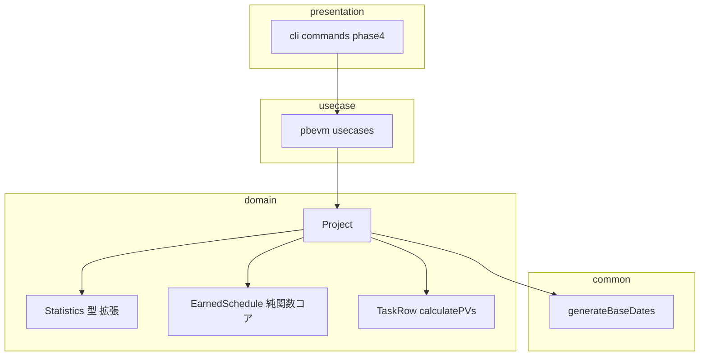
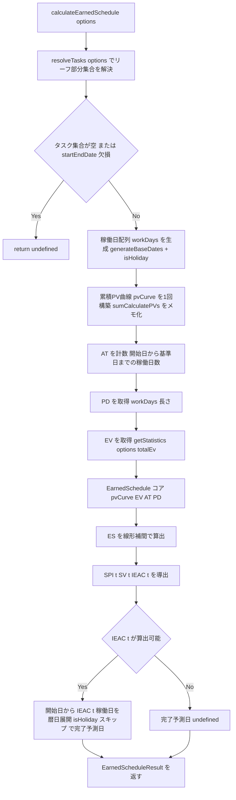
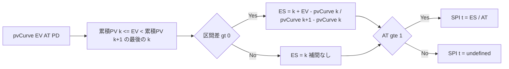

# 設計書: phase3-earned-schedule-0.0.32

## 概要

**目的**: 本 spec は evmtools-node に Earned Schedule（ES）理論を導入し、古典 SPI（EV÷累積PV）が抱えるスケジュール指標の欠陥を解消する。ES はスケジュール差異を時間軸（稼働日）に射影して表現するため、プロジェクト終盤で古典 SPI が 1.0 に収束しても遅延を検出できる。

**ユーザー**: ライブラリ利用側（masatomix/task の evmtools スキル、evmtools-webui）が、終盤の見かけ上の「順調」に惑わされず、遅延日数と現実的な完了時期を把握するために ES 指標を利用する。

**インパクト**: 追加入力を一切必要とせず、既存の累積PV曲線・EV・基準日のみから ES / SPI(t) / SV(t) / IEAC(t) / 完了予測日を算出する新指標を追加する。既存の統計取得 API は非破壊で、ES 指標はオプトイン（デフォルト off）で `Statistics` に含まれる。

### ゴール
- Date/Project 非依存の純関数として ES の数学コア（線形補間 + SPI(t)/SV(t)/IEAC(t)）を新設する。
- `Project.calculateEarnedSchedule()` が累積PV曲線を 1 回だけ構築・メモ化し、ES 結果（完了予測日を含む）を返す。
- `Statistics` に ES 指標をオプショナル追加し、`StatisticsOptions.includeEarnedSchedule`（既定 off）でオプトイン取得できる。
- フィルタで絞ったタスク部分集合に対しても同一ロジックで ES を算出する。
- 終盤の古典 SPI 1.0 収束と SPI(t) の乖離を検証で実証する。

### 非ゴール
- ES 指標の CLI 出力・Sカーブ時系列出力（phase4-scurve-eac-0.0.33）。
- EAC の悲観/楽観バリエーション（phase4）。
- コスト系指標（AC/CPI 等。AC 入力を要するため対象外）。
- #171 EVM 知識ベース本体の構築（phase5）。

## 境界コミットメント

### この spec が担うもの
- ES の型定義（`EarnedScheduleResult`）と、稼働日単位の ES 算出数学コア（線形補間・SPI(t)・SV(t)・IEAC(t)）。
- `Project.calculateEarnedSchedule(options?)` メソッド（曲線構築・AT/PD 計数・数学コア呼び出し・完了予測日の暦日展開）。
- `Statistics` 型への ES 指標のオプショナル追加（`spiT?`・`svT?`・`esForecastDate?`）と `StatisticsOptions.includeEarnedSchedule?`（既定 off）の新設・配線。
- フィルタ（`_resolveTasks` 経由）による部分集合 ES 算出。
- GLOSSARY への ES 用語追加、`docs/brainstorm-evm-indicators.md` ⓑ への注記、master 設計書（`Project.spec.md`）の同期。

### 境界の外
- CLI/Sカーブ出力、EAC バリエーション、コスト系指標（phase4）。
- 知識ベース本体（phase5）。
- `calculatePVs` の稼働日除外そのものの実装（phase0-bugfix-0.0.29 が担当済み。本 spec はその結果を利用するのみ）。
- 既存の公開 API（サブパス export、`getStatistics`/`getStatisticsByName`/`calculateCompletionForecast` の既定戻り値）のシグネチャ・既定挙動の変更。

### 許容する依存関係
- `Project.plannedWorkDays`（PD）、`generateBaseDates`、`Project.isHoliday`、`sumCalculatePVs`（稼働日除外済み・phase0 前提）、`_resolveTasks(options)`、`getStatistics(options).totalEv` に依存してよい。
- `calculateCompletionForecast` の暦日展開ループ（`isHoliday` スキップ）と同一パターンで完了予測日を算出してよい。
- 依存方向は `presentation → usecase → domain ← infrastructure` を維持。`EarnedSchedule.ts` は domain 内の純粋モジュールとして外部 I/O を持たない。

### 再検証トリガー
以下が変わった場合、下流（phase4/phase5）と利用側は統合を再確認する。
- `EarnedScheduleResult` のフィールド構成・単位（稼働日）の変更。
- `Statistics` に追加した ES フィールド名（`spiT`/`svT`/`esForecastDate`）や `includeEarnedSchedule` の意味・既定値の変更。
- 累積PV曲線の索引規約（0 始点/末尾 BAC）や ES 補間式の変更。
- `calculatePVs` の稼働日除外挙動（phase0）の変更。

## アーキテクチャ

### 既存アーキテクチャ分析
- クリーンアーキテクチャ（`presentation → usecase → domain ← infrastructure`、`common` は全層参照可）。domain 層は外部 I/O を持たない。
- 尊重すべき境界: `EarnedSchedule.ts` は `Project`/`TaskRow`/`Date` に依存しない純粋モジュールとし、曲線構築と暦日展開（`isHoliday` 依存）は `Project` に閉じる。
- 維持する統合ポイント: `getStatistics`/`getStatisticsByName` のオーバーロード、`_resolveTasks` のリーフフィルタ、`Statistics` のオプショナル拡張パターン（`etcPrime?`・`completionForecast?` と同様）。
- 再利用する資産: `plannedWorkDays`（PD）、`generateBaseDates`+`isHoliday`（稼働日配列/AT）、`sumCalculatePVs`（曲線各点、phase0 で稼働日除外済み）、`calculateCompletionForecast` の暦日展開ループ（740-747）。

### アーキテクチャパターン・境界マップ



**アーキテクチャ統合**:
- 選定パターン: 数学コアの純関数分離。ES 補間・SPI(t)/SV(t)/IEAC(t) を Date/Project 非依存の純関数へ、曲線構築・AT/PD 計数・暦日展開を `Project` へ配置する。
- ドメイン/機能の境界: 数値計算＝`EarnedSchedule.ts`、曲線構築と暦日 I/O＝`Project`、型公開＝`Statistics`。
- 維持する既存パターン: `getStatistics` オーバーロード、`_resolveTasks`、オプショナル統計フィールド、pino ロガー。
- 新規コンポーネントの根拠: `EarnedSchedule.ts` は手計算一致テストの容易化と phase4 再利用のための純粋コア。
- Steering との整合: `structure.md`（domain は外部依存なし・新規ドメインファイルは `src/domain/`）、`domain.md`（SPI 集計は ΣEV/ΣPV、稼働日判定は plotMap/isHoliday）、`roadmap.md`（Statistics 共有シームのフィールド名衝突回避）。

### 依存方向の制約
- `EarnedSchedule.ts` は `Project`・`TaskRow`・`Date`・`common` を import しない（数値配列と数値のみを入出力）。
- `Project` → `EarnedSchedule.ts`（一方向）。`EarnedSchedule.ts` から `Project` を参照しない。
- 完了予測日の暦日展開は `Project.isHoliday` に依存するため `Project` 側に置く（純粋コアへ Date を持ち込まない）。

### 技術スタック

| レイヤー | 採用技術 / バージョン | この機能での役割 | 備考 |
|----------|----------------------|------------------|------|
| Backend / Services | TypeScript 5.8（strict, CommonJS） | ES 型・純関数コア・Project メソッド | `any` 禁止。ES 系フィールドはオプショナル |
| Data / Storage | 既存 `plotMap`（Excel シリアル）/ `sumCalculatePVs` | 累積PV曲線の各点算出（稼働日除外済み） | phase0-bugfix-0.0.29 前提 |
| Infrastructure / Runtime | Node.js 20/22, Jest 30 + ts-jest | テスト・ビルド | CI で TZ=Asia/Tokyo / TZ=UTC 二重実行 |

## ファイル構成計画

### 新規ファイル
```
src/domain/
├── EarnedSchedule.ts        # ES 型 + 数学コア（純関数、Date/Project 非依存）
└── __tests__/
    ├── EarnedSchedule.test.ts             # 純関数コアの単体テスト（補間・境界・SPI(t)/IEAC(t)）
    └── Project.earnedSchedule.test.ts     # Project 統合（曲線構築・フィルタ・完了予測日・終盤乖離実証）
```

- `src/domain/EarnedSchedule.ts` — `EarnedScheduleResult` 型と、累積PV曲線（`number[]`）・EV・AT・PD を入力に ES/SPI(t)/SV(t)/IEAC(t) を返す純関数を定義。完了予測日（Date）は含めない。
- `src/domain/__tests__/EarnedSchedule.test.ts` — 手組み小規模プロジェクトの手計算一致、EV=0、EV=BAC、補間中間値、AT=0、ΔPV=0 区間を検証。
- `src/domain/__tests__/Project.earnedSchedule.test.ts` — 曲線構築の稼働日構成、フィルタ部分集合、完了予測日の暦日展開、休日跨ぎ、**終盤の古典 SPI 1.0 収束 vs SPI(t) 乖離**を検証。

### 変更ファイル
- `src/domain/Project.ts` — (1) `Statistics` 型に `spiT?`・`svT?`・`esForecastDate?` を追加。(2) `StatisticsOptions` に `includeEarnedSchedule?: boolean` を追加（既存の `TaskFilterOptions` 別名を interface/型拡張へ変更）。(3) `calculateEarnedSchedule(options?)` メソッド新設（曲線構築・AT/PD 計数・コア呼び出し・完了予測日暦日展開）。(4) 統計計算経路（`_calculateStatistics`/`_calculateAssigneeStats` の拡張統計段）で `includeEarnedSchedule` 有効時のみ ES 指標を合成。
- `src/domain/index.ts`（バレル） — `EarnedSchedule` 型のサブパス export 追加（`evmtools-node/domain` から利用可能にする）。
- `package.json` — バージョンを 0.0.32 に更新。
- `CHANGELOG`（既存の変更履歴ファイル） — ES 指標追加を Feature として明記（非破壊）。

### 改訂ドキュメント
- `docs/GLOSSARY.md` — ES/SPI(t)/SV(t)/IEAC(t)/AT/PD の定義・式を追加（Part II の EVM 計算セクション）。
- `docs/brainstorm-evm-indicators.md` — 知見ⓑ に「Earned Schedule（SPI(t)）で解決」の注記を追加。
- `docs/specs/domain/master/Project.spec.md` — `calculateEarnedSchedule`・`Statistics` 拡張・テストシナリオ・要件トレーサビリティ・変更履歴を同期。

> 各ファイルは単一責務。数学は `EarnedSchedule.ts`、曲線構築と Date I/O は `Project.ts`。物理配置のみ本節で扱い、契約は「コンポーネント・インターフェース」で定義する。

## システムフロー

### ES 算出フロー



- 曲線は開始日→終了日の全稼働日で 1 回だけ構築し、探索・補間で再利用する（要件 6.2）。基準日を超える先行（EV>AT時点PV）にも対応するため曲線は終了日まで持つ。
- `EV >= 曲線末尾（BAC）` は ES=PD にクランプ（外挿しない、要件 1.3）。`EV=0` は ES=0（要件 1.2）。

### ES と AT の関係（境界）



## 要件トレーサビリティ

| 要件 | 概要 | コンポーネント | インターフェース | フロー |
|------|------|----------------|------------------|--------|
| 1.1〜1.7 | ES の線形補間算出・境界（EV=0/BAC、先行/遅延、ΔPV=0、undefined） | EarnedSchedule コア | `calculateEarnedSchedule(curveInput)` | ES と AT の関係 |
| 2.1〜2.7 | AT/PD/SPI(t)/SV(t)/IEAC(t) の導出と AT=0/SPI(t)<=0 の境界 | EarnedSchedule コア | `calculateEarnedSchedule(curveInput)` | ES と AT の関係 |
| 2.8 | 完了予測日の暦日展開 | Project | `Project.calculateEarnedSchedule` | ES 算出フロー |
| 3.1, 3.2 | 終盤の古典 SPI 1.0 収束 vs SPI(t) 乖離の実証 | EarnedSchedule コア, Project | `calculateEarnedSchedule`, テスト | ES と AT の関係 |
| 4.1〜4.4 | Statistics オプトイン統合（既定 off、オプショナル、非破壊） | Statistics 型, Project | `Statistics`, `StatisticsOptions`, `getStatistics` | ES 算出フロー |
| 5.1〜5.3 | フィルタ部分集合の ES 算出（空集合安全） | Project | `Project.calculateEarnedSchedule(options)` | ES 算出フロー |
| 6.1〜6.3 | 稼働日構成の曲線・1回構築メモ化・休日跨ぎ一貫性 | Project | 曲線構築（内部） | ES 算出フロー |
| 7.1〜7.4 | GLOSSARY/brainstorm/master 設計書の同期・トレーサビリティ | docs | GLOSSARY, brainstorm, Project.spec.md | — |

## コンポーネント・インターフェース

| コンポーネント | ドメイン/レイヤー | 目的 | 要件カバレッジ | 主な依存（P0/P1） | 契約 |
|----------------|--------------------|------|----------------|---------------------|------|
| EarnedSchedule コア | domain（新規純関数） | 累積PV曲線と EV/AT/PD から ES/SPI(t)/SV(t)/IEAC(t) を算出 | 1, 2, 3 | なし（純粋） | Service |
| Project.calculateEarnedSchedule | domain | 曲線構築・AT/PD 計数・コア呼び出し・完了予測日暦日展開・フィルタ対応 | 2.8, 5, 6 | plannedWorkDays/generateBaseDates/isHoliday/sumCalculatePVs (P0), EarnedSchedule コア (P0), _resolveTasks/getStatistics (P0) | Service |
| Statistics 型拡張 | domain | ES 指標のオプショナル公開とオプトインフラグ | 4 | 既存 Statistics/StatisticsOptions (P0) | State |

### domain レイヤー

#### EarnedSchedule コア（`src/domain/EarnedSchedule.ts`）

| 項目 | 内容 |
|------|------|
| 目的 | 稼働日単位の累積PV曲線と EV/AT/PD から ES・SPI(t)・SV(t)・IEAC(t) を算出する純関数 |
| 要件 | 1.1〜1.7, 2.1〜2.7, 3.1, 3.2 |

**責務と制約**
- Date/Project/common を一切 import しない。入力は数値配列と数値のみ、出力は数値（+ undefined）のみ。
- 累積PV曲線の索引規約: `pvCurve[i]` は「i 番目の稼働日終了時点の累積PV」で単調非減少。`pvCurve.length === PD`、`pvCurve[PD-1] === BAC`（曲線末尾）とする。ES の稼働日単位は 1 始点（i 番目の稼働日到達 = ES 値 i+1 相当）で表現し、実装時に手計算一致テストで固定する。
- 補間・クランプ・境界（EV=0、EV>=BAC、ΔPV=0、AT=0、SPI(t)<=0）はすべてガード節で処理する。
- 完了予測日（Date）は責務外（Project が算出）。

**依存関係**
- インバウンド: Project.calculateEarnedSchedule — ES 数値の算出（P0）
- アウトバウンド: なし（純粋関数）
- 外部: なし

**契約**: Service [x]

##### サービスインターフェース
```typescript
/** Earned Schedule の算出結果（時間単位はすべて稼働日） */
export interface EarnedScheduleResult {
    /** Earned Schedule（稼働日単位）。算出不能時は呼び出し側で undefined 判定 */
    es: number
    /** Actual Time（開始日→基準日の稼働日数） */
    at: number
    /** SPI(t) = ES / AT。AT=0 のとき undefined */
    spiT: number | undefined
    /** SV(t) = ES − AT（稼働日、正で先行・負で遅延） */
    svT: number
    /** IEAC(t) = PD / SPI(t)（稼働日）。SPI(t) が undefined または 0 以下のとき undefined */
    iEacT: number | undefined
    /** Planned Duration = 計画総稼働日数（PD） */
    pd: number
}

/** 純関数コアへの入力（Date 非依存） */
export interface EarnedScheduleInput {
    /** 稼働日ごとの累積PV曲線（単調非減少、length === pd、末尾が BAC） */
    pvCurve: number[]
    /** 現在の EV（リーフ合計） */
    ev: number
    /** Actual Time（稼働日数） */
    at: number
    /** Planned Duration（稼働日数、通常 pvCurve.length） */
    pd: number
}

/** ES 指標を算出する。前提が満たせない場合は undefined */
export const calculateEarnedSchedule = (
    input: EarnedScheduleInput
): EarnedScheduleResult | undefined => { /* ... */ }
```
- 事前条件: `pvCurve` は単調非減少。`ev >= 0`。`pd >= 0`。
- 事後条件:
  - `pvCurve.length === 0` または `pd === 0` → `undefined`（要件 1.7）。
  - `ev === 0` → `es = 0`（要件 1.2）。`ev >= pvCurve[pvCurve.length-1]`（BAC）→ `es = pd`（要件 1.3）。
  - それ以外は `累積PV(k) <= ev < 累積PV(k+1)` の最後の k を求め、区間差 > 0 なら線形補間、区間差 <= 0 なら `es = k`（要件 1.1, 1.6）。
  - `es >= at`（EV が AT 時点PV 以上）／`es < at`（未満）を満たす（要件 1.4, 1.5）。
  - `at >= 1` → `spiT = es / at`、それ以外 `spiT = undefined`（要件 2.3, 2.4）。`svT = es − at`（要件 2.5）。
  - `spiT` が定義かつ > 0 → `iEacT = pd / spiT`、それ以外 `undefined`（要件 2.6, 2.7）。
- 不変条件: Date/TZ に依存しない（すべて数値演算）。

**実装メモ**
- 統合: `Project.calculateEarnedSchedule` から曲線・EV・AT・PD を受け取る。手計算一致テストで索引規約を固定。
- バリデーション: 単調非減少でない曲線は上流（Project）が保証。コアは防御的に区間差 <= 0 を要件 1.6 で処理。
- リスク: 索引規約の 0/1 始点解釈ずれ → テストで固定。

#### Project.calculateEarnedSchedule（`src/domain/Project.ts`）

| 項目 | 内容 |
|------|------|
| 目的 | 累積PV曲線を 1 回構築し AT/PD/EV を計数、コアへ委譲、完了予測日を暦日展開する。フィルタ対応 |
| 要件 | 2.8, 5.1〜5.3, 6.1〜6.3 |

**責務と制約**
- `_resolveTasks(options)` でリーフ部分集合を解決（要件 5.1, 5.3）。空集合または開始/終了日欠損時は `undefined`（要件 5.2）。
- 稼働日配列 = `generateBaseDates(startDate, endDate).filter((d) => !this.isHoliday(d))`。PD = 配列長（= `plannedWorkDays` と一致）。曲線 `pvCurve[i] = sumCalculatePVs(leafTasks, workDays[i])` を 1 回だけ構築しメモ化（要件 6.1, 6.2）。
- AT = `generateBaseDates(startDate, baseDate).filter(!isHoliday).length`。
- EV = `getStatistics(options).totalEv ?? 0`。
- 完了予測日: `iEacT` が算出できた場合、`calculateCompletionForecast` の暦日展開ループ（740-747）と同一パターンで開始日から `iEacT` 稼働日分を進めた暦日を返す（要件 2.8）。

**依存関係**
- インバウンド: 統計計算経路（`_calculateStatistics`/`_calculateAssigneeStats`）、利用側 API（P0）
- アウトバウンド: EarnedSchedule コア（P0）、`generateBaseDates`/`isHoliday`/`sumCalculatePVs`/`plannedWorkDays`/`_resolveTasks`/`getStatistics`（P0）
- 外部: なし

**契約**: Service [x]

##### サービスインターフェース
```typescript
// プロジェクト全体または options で絞った部分集合の ES 指標 + 完了予測日
calculateEarnedSchedule(
    options?: StatisticsOptions
): EarnedScheduleResult & { esForecastDate: Date | undefined } | undefined
```
- 事前条件: `startDate`/`endDate` が設定されていること（未設定なら `undefined`）。
- 事後条件:
  - リーフ部分集合が空 → `undefined`（要件 5.2）。
  - 曲線は稼働日のみで構成され（要件 6.1）、1 回構築でメモ化される（要件 6.2）。
  - `esForecastDate` は `iEacT` が算出可能なときのみ暦日、そうでなければ `undefined`（要件 2.8）。
- 不変条件: 休日跨ぎでも稼働日インデックス基準で一貫（要件 6.3）。TZ に依存しない。

**実装メモ**
- 統合: フィルタ指定時は部分集合ごとに曲線を再構築（メモ化キーにフィルタを含める）。
- バリデーション: `totalEv` が undefined の場合は 0 として扱い、曲線末尾 BAC=0 のプロジェクトは `undefined`。
- リスク: 大規模で曲線構築コスト → デフォルト off のオプトインに限定（要件 4.4）。

#### Statistics 型拡張（`src/domain/Project.ts`）

| 項目 | 内容 |
|------|------|
| 目的 | ES 指標をオプショナル公開し、オプトインフラグを追加する |
| 要件 | 4.1〜4.4 |

**責務と制約**
- 既存の拡張プロパティ（`etcPrime?`・`completionForecast?`）と同様にオプショナル追加。既存呼び出しの戻り値形状を変えない（要件 4.3）。
- フィールド名は ES 専用命名で phase5 拡張との衝突を避ける（`roadmap.md` 共有シーム注意）。

**契約**: State [x]

##### 状態管理
```typescript
export type Statistics = {
    // ...既存フィールド...
    /** SPI(t) = ES / AT（時間ベースのスケジュール効率）。ES 未算出時は undefined */
    spiT?: number
    /** SV(t) = ES − AT（稼働日、負で遅延）。ES 未算出時は undefined */
    svT?: number
    /** ES 由来の完了予測日。算出不能時は undefined */
    esForecastDate?: Date
}

// 既存: export type StatisticsOptions = TaskFilterOptions
export interface StatisticsOptions extends TaskFilterOptions {
    /** ES 指標を算出して統計に含める（既定 false = 算出しない） */
    includeEarnedSchedule?: boolean
}
```
- 状態モデル: `includeEarnedSchedule !== true` のとき ES フィールドはすべて未設定（要件 4.2）。
- 永続化と一貫性: `getStatistics`/`getStatisticsByName` の拡張統計段で、フラグ有効時のみ `calculateEarnedSchedule(options)` を呼んで合成（要件 4.1, 4.4）。
- 並行性戦略: 副作用なしの純算出。

**実装メモ**
- 統合: `StatisticsOptions` を型別名から interface 拡張へ変更（`TaskFilterOptions` を継承）。既存の `filter` 利用箇所は非破壊。
- バリデーション: フラグ未指定は既定 off（既存の計算コストを増やさない、要件 4.4）。
- リスク: 型別名→interface 変更で `StatisticsOptions` を import する箇所の再確認。

## エラー処理

### エラー処理戦略
- 算出不能は例外ではなく `undefined`（ES 全体・SPI(t)・IEAC(t)・完了予測日）で表現する既存方針を踏襲する。
- 空タスク集合・開始/終了日欠損・BAC=0 は `Project.calculateEarnedSchedule` が `undefined` に正規化する。
- AT=0（開始日=基準日）は SPI(t)/IEAC(t)/完了予測日を `undefined` とし、SV(t)（= ES − 0 = ES）は算出する。

### モニタリング
- ES 固有の警告は追加しない。曲線構築の前提（稼働日除外）は phase0 の CI（TZ 二重実行）と本 spec のテストで担保する。

## テスト戦略

### ユニットテスト（EarnedSchedule コア）
- 手組み小規模プロジェクト（例: 5 稼働日 × 2 タスク）の累積PV曲線で ES を手計算値と一致させる（要件 1.1、索引規約固定）。
- EV=0 → ES=0（要件 1.2）。EV=BAC → ES=PD（要件 1.3）。
- 補間中間値: 区間内の EV で `ES = k + 端数` を検証（要件 1.1）。
- ΔPV=0 の区間で補間せず `ES=k`（要件 1.6）。
- AT=0 → SPI(t)=undefined、SV(t)=ES（要件 2.4, 2.5）。SPI(t)<=0 相当（ES=0）→ IEAC(t)=undefined（要件 2.7）。
- 先行（EV>=AT時点PV → ES>=AT）と遅延（EV<AT時点PV → ES<AT）の符号（要件 1.4, 1.5, 2.5）。

### 統合テスト（Project.earnedSchedule）
- 曲線が稼働日のみで構成される（土日/祝日を含むデータで休日を除外、要件 6.1）。
- 休日跨ぎの基準日で稼働日インデックス基準の一貫した ES（要件 6.3）。
- 完了予測日の暦日展開が `calculateCompletionForecast` と同一パターンで土日/祝日をスキップ（要件 2.8）。
- フィルタ指定でタスク部分集合の ES 算出、空集合で `undefined`（要件 5.1, 5.2）。
- `StatisticsOptions.includeEarnedSchedule` 有効時のみ `Statistics.spiT`/`svT`/`esForecastDate` が設定され、既定 off では未設定・戻り値形状不変（要件 4.1〜4.4）。
- **終盤遅延シナリオ**: EV が BAC 接近で古典 `spi` が 1.0 近傍に収束する一方、`spiT` が 1.0 未満（遅延）を返すことを同一データで実証（要件 3.1, 3.2）。

### 検証ゲート
- `npm run lint && npm run format && npm test && npm run build`（CI 同一、Node 20/22）＋ TZ=Asia/Tokyo / TZ=UTC 二重実行。
- `npm pack` した tgz を task リポジトリへ file: インストールし、`getStatistics({ includeEarnedSchedule: true })` 経由で ES 指標が取得できることを確認。

## 補足参照

### 索引規約の確定（実装時にテストで固定）
- `pvCurve[i]` は i 番目の稼働日（開始日を i=0 とする稼働日列）終了時点の累積PV。`pvCurve.length === PD`、末尾 = BAC。
- ES の稼働日単位は「到達した稼働日数」。EV がちょうど `pvCurve[k]` に一致する場合 ES は k 番目稼働日到達を表す整数値、区間内は線形補間。0/1 始点の最終確定は手計算一致テスト（5 稼働日 × 2 タスク）で行う。
- 詳細な理論根拠・代替案は `research.md` を参照。
