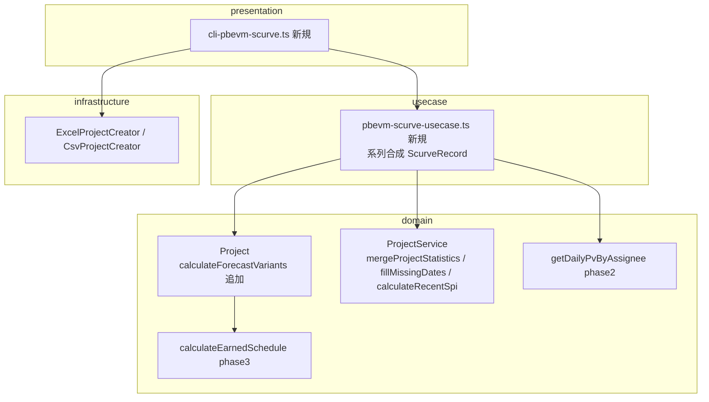
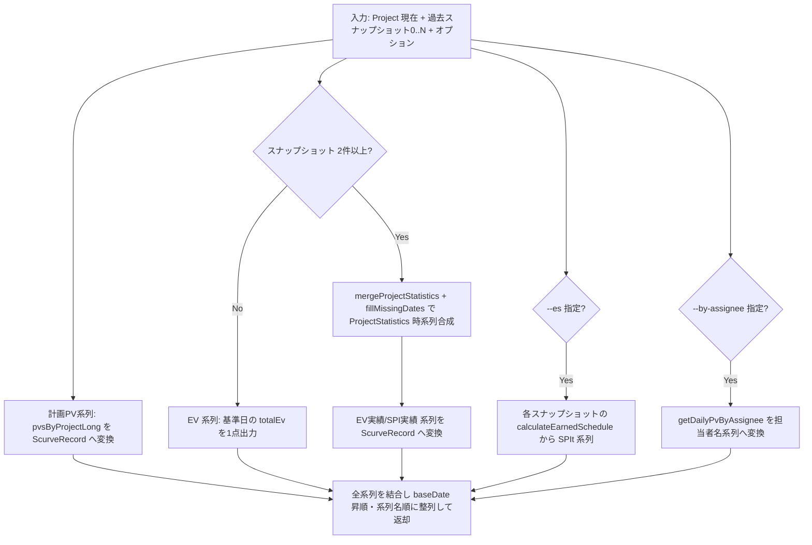

# 設計書: phase4-scurve-eac-0.0.33

> **スコープ確定（2026-07-06、ユーザー判断で正式記録）**: 本 spec は**実装せず終結**。
> 経緯: v0.0.31 リリース後の価値再評価で見送り方向となったが記録が漏れていたため、監査を経てここに確定する。
> - ① pbevm-scurve CLI → **見送り**（計算データは公開済み。整形/出口はプレゼン層＝利用側の領分。再開条件つき Backlog: [#192](https://github.com/masatomix/evmtools-node/issues/192)）
> - ② calculateForecastVariants → **見送り**（`calculateCompletionForecast({spiOverride})`×3 で合成可能。公式レシピを docs/EVM-MANAGEMENT-GUIDE.md に記載）
> - ③ コスト系 EVM 設計メモ → **実施済み**（`docs/specs/requirements/REQ-COST-EVM-DRAFT.md`、Backlog: [#191](https://github.com/masatomix/evmtools-node/issues/191)）
> 承認済みの設計（ScurveRecord/buildScurveRecords 等）は再開時に本 spec から利用できる。


## 概要

**目的**: 本機能は、EVM 可視化（S カーブ・SPI トレンド）用のグラフデータ出力と、楽観/標準/悲観の 3 点完了予測を、プロジェクト管理者・ライブラリ利用者に提供する。
**ユーザー**: CLI 利用者（`pbevm-scurve` で CSV を取得し Excel/BI で描画）、ライブラリ利用者（usecase/domain の型と関数を直接利用）、保守者（標準 EVM 式との対応ドキュメント）。
**インパクト**: 既存ドメイン層に揃っているデータ（`pvsByProjectLong`、`mergeProjectStatistics`+`fillMissingDates`、phase3 の ES、phase2 の担当者別日次 PV）に「出口」を追加する。既存 API はすべて非破壊。

### ゴール
- `pbevm-scurve` CLI がロング形式（日付×系列×値）の CSV/コンソール出力を行い、Excel でそのまま S カーブが描ける
- `Project.calculateForecastVariants()` が楽観/標準/悲観の 3 点予測を返す（既存 `calculateCompletionForecast` の薄いラッパー）
- 標準 EVM 式対応表・期間 SPI 接続例・コスト系設計メモがドキュメントとして残る

### 非ゴール
- グラフ描画そのもの（Excel/BI へ委譲）
- コスト系 EVM の実装（設計メモのみ。`REQ-COST-EVM-DRAFT.md`）
- `calculateCompletionForecast` の内部ロジック変更
- Web API / WebUI への組み込み

## 境界コミットメント

### この spec が担うもの
- `src/usecase/pbevm-scurve-usecase.ts`（S カーブ系列合成ロジックと `ScurveRecord` 等の型）と `src/presentation/cli-pbevm-scurve.ts`（CLI）、package.json bin 登録
- `Project.calculateForecastVariants(options?)` と関連型（`ForecastVariants` / `ForecastVariantsOptions`）の定義・export
- docs 4 点: `EVM-MANAGEMENT-GUIDE.md` 対応表、`docs/examples/04-completion-forecast.md` 追記、`docs/examples/06-cli-commands.md` 追記、`docs/specs/requirements/REQ-COST-EVM-DRAFT.md` 新設
- feature/master 設計書同期、v0.0.33 リリース準備

### 境界の外
- phase2/phase3 が定義した API（`getDailyPvByAssignee` / `calculateEarnedSchedule`）の実装・変更 — 利用のみ
- `ProjectService.calculateRecentSpi` の実装変更（phase0 成果物の利用のみ）
- 既存 CLI（pbevm-show-pv 等）の変更
- スナップショットの永続化・履歴管理（入力は複数ファイルとして受け取る現行方式のまま）

### 許容する依存関係
- phase3: `Project.calculateEarnedSchedule(options?)` → `EarnedScheduleResult`（`spiT` を悲観シナリオ・ES 系列に使用）
- phase2: `Project.getDailyPvByAssignee(options?)` → `DailyPvEntry[]`（担当者別系列に使用）
- phase0: `ProjectService.calculateRecentSpi(projects, options?)`（期間 SPI。算出不能時 undefined）
- 既存の安定 API: `Project.pvsByProjectLong`（累積 PV、`LongData[]`）、`getStatistics()`（`totalEv`/`spi`）、`calculateCompletionForecast(options)`（`spiOverride`）、`ProjectService.mergeProjectStatistics` / `fillMissingDates`（`ProjectStatistics[]`）、`common` の `dateStr`
- 依存方向 `presentation → usecase → domain` を維持。系列合成は usecase、予測バリエーションは domain

### 再検証トリガー
- `ScurveRecord` の列構成（baseDate/series/value）や系列名の変更
- `ForecastVariants` のフィールド構成・悲観 SPI の選定規則の変更
- 上流の再検証トリガー発火: phase3 `EarnedScheduleResult` のフィールド変更、phase2 `DailyPvEntry` の形状変更、`ProjectStatistics` のフィールド名変更

## アーキテクチャ

### 既存アーキテクチャ分析
- クリーンアーキテクチャ（`presentation → usecase → domain ← infrastructure`、`common` は全層参照可）
- CLI の踏襲パターン: `src/presentation/cli-pbevm-show-pv.ts` + `src/usecase/pbevm-show-pv-usecase.ts` のペア（yargs、usecase へ委譲、bin 登録）
- 既存データソース（検証済みの事実）:
  - `Project.pvsByProjectLong`（`Project.ts:506-508`）= 累積 PV の `LongData[]`（`{assignee, baseDate, value?}`、`assignee` フィールドに `row.assignee ?? '(未割当)'` が入る点に注意。日付軸は `generateBaseDates(_startDate, _endDate)`）
  - EV/SPI トレンドの時系列型は専用型がなく **`ProjectStatistics[]`**（要素 = スナップショット毎、`{baseDate, totalPvCalculated, totalEv, spi, ...}`）。`mergeProjectStatistics`（`ProjectService.ts:280-299`、baseDate キーで Map マージ・降順）+ `fillMissingDates`（同 307 行〜、欠損日を前値クローンで補完）で合成
  - `CompletionForecast`（`Project.ts:1001-1018`）= `{etcPrime, forecastDate, remainingWork, usedDailyPv, usedSpi, dailyBurnRate, confidence, confidenceReason}`。`CompletionForecastOptions`（968-983）に `spiOverride?` あり
  - package.json bin（41-47 行）に 5 コマンド登録済み、`pbevm-scurve` は未登録。usecase バレル（`src/usecase/index.ts`）は 4 usecase を export

### アーキテクチャパターン・境界マップ



- 選定パターン: 既存の CLI/usecase ペアパターンの踏襲。系列合成（ロング形式への整形）は usecase 層、SPI シナリオ選定は domain 層（`Project` のメソッド）
- 新規コンポーネントの根拠: `ScurveRecord` は既存 `LongData` と異なり系列名フィールド（`series`）を持つ表示用型のため usecase 層で新設（`LongData.assignee` の流用は意味が濁るため不採用）

## ファイル構成計画

### 新規ファイル
```
src/
├── usecase/
│   ├── pbevm-scurve-usecase.ts          # ScurveRecord 型・系列合成・CSV 文字列化
│   └── __tests__/pbevm-scurve-usecase.test.ts
├── presentation/
│   ├── cli-pbevm-scurve.ts              # yargs CLI（show-pv 踏襲）
│   └── __tests__/cli-pbevm-scurve.test.ts
docs/specs/requirements/REQ-COST-EVM-DRAFT.md   # コスト系設計メモ（実装しない旨明記）
docs/specs/domain/features/Project.forecastVariants.spec.md  # 案件設計書（トレーサビリティ表必須）
```

### 変更ファイル
- `src/domain/Project.ts` — `calculateForecastVariants(options?)` メソッドと `ForecastVariants` / `ForecastVariantsOptions` 型を追加（既存メソッドは不変）
- `src/domain/index.ts` — 新規型の export 追加
- `src/usecase/index.ts` — `pbevm-scurve-usecase` の export 追加（既存 4 行に追記のみ）
- `package.json` — bin に `"pbevm-scurve": "./dist/presentation/cli-pbevm-scurve.js"` 追加、バージョン 0.0.33
- `src/domain/__tests__/Project.forecastVariants.test.ts` — 新設
- `docs/EVM-MANAGEMENT-GUIDE.md` — 標準 EVM 式対応表を追加
- `docs/examples/04-completion-forecast.md` — 期間 SPI → `spiOverride` 接続例を追記
- `docs/examples/06-cli-commands.md` — `## pbevm-scurve` セクション（使用方法/オプション/出力例の既存パターン）+ `## 利用可能なコマンド` リスト + `## npm scripts` ブロックへ追記
- `docs/specs/domain/master/Project.spec.md` — メソッド仕様・テストシナリオ・変更履歴の同期
- `CHANGELOG.md` — Added として記載（非破壊）

## システムフロー

### S カーブ系列合成（usecase）



- ゲート条件: 開始/終了日欠損・対象タスク空は空配列（例外なし、AC 1.6）。オプション系列が算出不能なら当該系列のみ空で継続（AC 3.4）
- スナップショット 1 件時は実績トレンドを合成せず単一ファイル出力へフォールバック（AC 2.5）

## 要件トレーサビリティ

| 要件 | 概要 | コンポーネント | インターフェース | フロー |
|------|------|----------------|------------------|--------|
| 1.1-1.6 | 単一ファイルの計画PV+EV点 | ScurveUsecase | `buildScurveRecords` | S カーブ系列合成 |
| 2.1-2.5 | 複数スナップショット実績トレンド | ScurveUsecase | `buildScurveRecords`（複数入力） | 同上 |
| 3.1-3.4 | ES/担当者別オプション系列 | ScurveUsecase | `ScurveOptions.includeEs / byAssignee` | 同上 |
| 4.1-4.6 | CLI・CSV 出力・bin 登録 | ScurveCli | yargs 引数仕様 | CLI→usecase 委譲 |
| 5.1-5.7 | 3 点完了予測 | Project.calculateForecastVariants | `ForecastVariants` | 予測バリエーション |
| 6.1-6.3 | ドキュメント | docs 3 点 | - | - |
| 7.1-7.5 | コスト系設計メモ | REQ-COST-EVM-DRAFT.md | - | - |
| 8.1-8.3 | 後方互換 | バレル追記のみ | export 追加 | - |
| 9.1-9.4 | 検証・master 同期 | 検証ゲート/master spec | - | - |

## コンポーネント・インターフェース

| コンポーネント | レイヤー | 目的 | 要件 | 主な依存 | 契約 |
|----------------|----------|------|------|----------|------|
| ScurveUsecase | usecase | ロング形式系列の合成と CSV 文字列化 | 1,2,3,8 | Project (P0), ProjectService (P0), phase2/3 API (P1) | Service |
| ScurveCli | presentation | 引数解釈・入出力 | 4 | ScurveUsecase (P0), ExcelProjectCreator (P0) | CLI |
| ForecastVariants | domain | 3 点完了予測 | 5,8 | calculateCompletionForecast (P0), calculateEarnedSchedule (P1) | Service |

### usecase 層

#### ScurveUsecase

| 項目 | 内容 |
|------|------|
| 目的 | 現在+過去スナップショットとオプションから `ScurveRecord[]` を合成し、CSV 文字列化する |
| 要件 | 1.1-1.6, 2.1-2.5, 3.1-3.4, 8.1 |

**サービスインターフェース**
```typescript
// src/usecase/pbevm-scurve-usecase.ts
export type ScurveRecord = {
  baseDate: string   // YYYY-MM-DD（dateStr 準拠）
  series: string     // '計画PV' | 'EV' | 'EV実績' | 'SPI実績' | 'SPI(t)' | 担当者名
  value: number
}

export interface ScurveOptions {
  filter?: string          // 既存 TaskFilterOptions.filter と同義（Project 側の解決機構に委譲）
  includeEs?: boolean      // 既定 false: SPI(t) 系列を追加（phase3）
  byAssignee?: boolean     // 既定 false: 担当者別 PV 系列を追加（phase2）
}

// snapshots は baseDate 昇順である必要はない（内部でソート）。current は最新スナップショット
export const buildScurveRecords = (
  current: Project,
  snapshots?: Project[],          // current 含む複数入力。省略/1件なら単一ファイルモード
  options?: ScurveOptions
): ScurveRecord[]

export const toCsv = (records: ScurveRecord[]): string  // ヘッダ: baseDate,series,value
```
- 事前条件: なし（欠損・空は空配列で応答）
- 事後条件: レコードは baseDate 昇順・同日付内は系列名順。同一 (baseDate, series) の重複なし
- 不変条件: 入力 Project 群を変更しない（読み取りのみ）

**実装メモ**
- 計画PV: `current.pvsByProjectLong`（累積・`LongData[]`）→ `{baseDate, series:'計画PV', value}`。フィルタ指定時は `_resolveTasks` 相当のフィルタ済み統計経路（`getStatistics({filter})` と同一機構）を使う設計とし、既存 getter がフィルタ非対応の場合は phase2 の `getDailyPvByAssignee({filter})` の合計で代替可能かを実装時に判断（判断結果を master 同期に記録）
- 実績トレンド: 各スナップショットの `getStatistics()` を `ProjectStatistics` 化 → `mergeProjectStatistics([], stats)` + `fillMissingDates` → `totalEv`→'EV実績'、`spi`→'SPI実績'。`fillMissingDates` の前値クローン仕様により欠損日は直前値で埋まる（AC 2.3）
- ES 系列: 各スナップショットの `calculateEarnedSchedule()?.spiT` を当該 baseDate の 'SPI(t)' レコードに（undefined はスキップ、AC 3.4）
- 担当者別: `current.getDailyPvByAssignee(options)` の `DailyPvEntry[]` を `{baseDate, series: assignee, value: pv}` へ変換

#### ScurveCli

| 項目 | 内容 |
|------|------|
| 目的 | yargs で引数解釈し usecase へ委譲、コンソール表 + CSV ファイル出力 |
| 要件 | 4.1-4.6 |

**CLI 契約**（`cli-pbevm-show-pv.ts` の構造踏襲）
| 引数/オプション | 型 | 説明 |
|----------------|----|------|
| `--file <path...>` | string[] | 入力 Excel（複数指定で実績トレンド合成。1件なら単一モード） |
| `--output <path>` | string | CSV 出力先（既定: `scurve.csv`） |
| `--filter <str>` | string | タスク名フィルタ |
| `--es` | boolean | SPI(t) 系列を追加 |
| `--by-assignee` | boolean | 担当者別 PV 系列を追加 |

- ビジネスロジックを持たない（生成は usecase、AC 4.6）。bin 登録名 `pbevm-scurve`

### domain 層

#### Project.calculateForecastVariants

| 項目 | 内容 |
|------|------|
| 目的 | 楽観/標準/悲観の 3 点完了予測（既存予測の薄いラッパー） |
| 要件 | 5.1-5.7 |

**サービスインターフェース**
```typescript
// src/domain/Project.ts に追加
export interface ForecastVariantsOptions extends CompletionForecastOptions, StatisticsOptions {
  periodSpi?: number   // 期間SPI（ΔEV/ΔPV）。複数スナップショットを持つ呼び出し側が
                       // ProjectService.calculateRecentSpi で算出して渡す（Project 単体では算出不能）
}

export interface ForecastVariants {
  optimistic: CompletionForecast | undefined   // SPI = 1
  standard: CompletionForecast | undefined     // 累積 SPI（spiOverride なし）
  pessimistic: CompletionForecast | undefined  // min(periodSpi, spiT) → fallback 標準
  pessimisticBasis: 'periodSpi' | 'spiT' | 'standardFallback'  // 悲観に使った SPI の出所
}

calculateForecastVariants(options?: ForecastVariantsOptions): ForecastVariants
```
- 事前条件: なし。事後条件: 各シナリオは `calculateCompletionForecast` の戻り値そのまま（内部変更なし、AC 5.6）
- 悲観 SPI の選定: `candidates = [options?.periodSpi, this.calculateEarnedSchedule(options)?.spiT].filter(有効値)` → 最小値。空なら標準 SPI にフォールバックし `pessimisticBasis='standardFallback'`（AC 5.4, 5.5）
- 楽観は `spiOverride: 1`、標準は `spiOverride` 未指定で委譲（AC 5.2, 5.3）

## データモデル

- `ScurveRecord` は表示用のフラットなロング形式（グラフツール向け）。ドメインエンティティではないため usecase 層に置く
- CSV 列構成: `baseDate,series,value`（ヘッダ行あり、UTF-8、AC 4.3）。Excel のピボット/散布図でそのまま系列分割可能
- 既存型との対応: `LongData.assignee` → `ScurveRecord.series`（変換時に意味を付け替える。逆変換はしない）

## エラー処理

- 入力ファイル不存在/読込失敗: CLI 層で既存 pbevm-* と同一のエラーメッセージ・非 0 終了
- 開始/終了日欠損・タスク空: usecase は空配列を返し、CLI は「出力対象データがありません」を表示して正常終了（AC 1.6）
- オプション系列の算出不能（ES 前提欠如・担当者データなし）: 当該系列のみ空、他系列は出力継続（AC 3.4）。CLI は警告行を表示
- 予測不能（SPI undefined 等）: `ForecastVariants` の該当フィールドが undefined（既存 `calculateCompletionForecast` の挙動に従う）

## テスト戦略

- ユニット（usecase）: 単一入力の計画PV+EV 1点（AC 1.1-1.4）、フィルタ指定（1.5）、欠損/空で空配列（1.6）、複数入力の EV実績/SPI実績合成と欠損日補完（2.1-2.4）、1件フォールバック（2.5）、ES/担当者別オプションの on/off と算出不能スキップ（3.1-3.4）、toCsv の列構成
- ユニット（domain）: calculateForecastVariants の 3 シナリオ SPI 選定（5.2-5.4）、periodSpi/spiT 片方欠落・両方欠落フォールバック（5.5）、既存予測との等価性（spiOverride を直接渡した結果と一致 = 薄いラッパー性、5.6）
- 統合（CLI）: bin 起動（`cli-shebang.test.ts` パターン）、複数ファイル指定、CSV ファイル生成
- 目視検証: サンプルデータの CSV を Excel に取り込み S カーブ描画（AC 9.1、手順を tasks に記載）

## 補足参照

- 背景調査は `research.md`（既存 API の行番号・型の検証結果）を参照。設計判断はすべて本書に記載済み
- コスト系 EVM の設計案本体は成果物 `docs/specs/requirements/REQ-COST-EVM-DRAFT.md` に記載する（本設計書には含めない）
