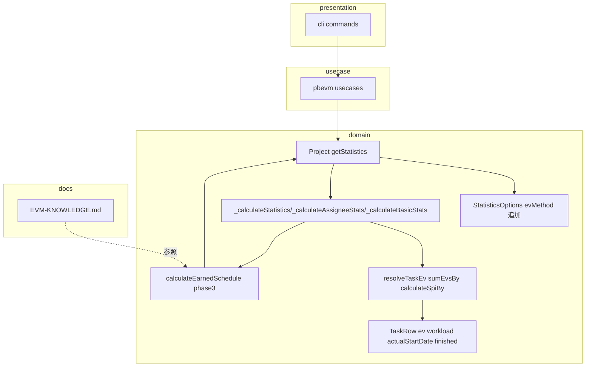
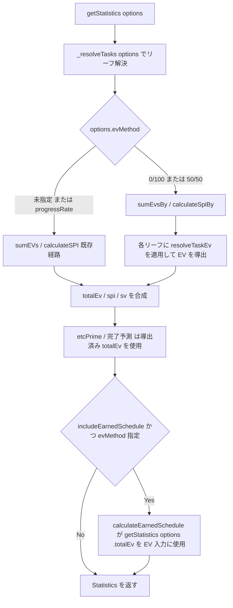
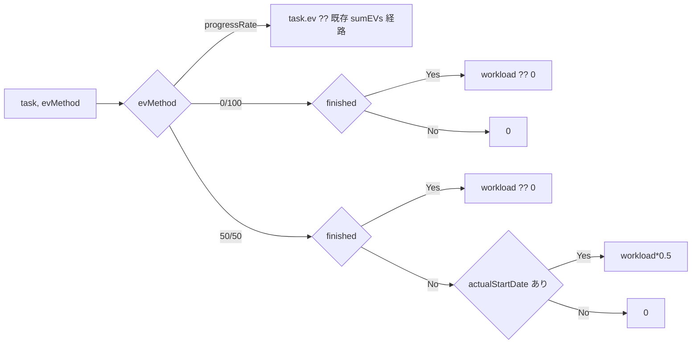

# 設計書: phase5-evmethod-knowledge-0.0.34

## 概要

**目的**: 本 spec は evmtools-node に (1) EV 算定方式オプション `evMethod`（`'progressRate'` / `'0/100'` / `'50/50'`）と、(2) #171 EVM 知見（ⓐ〜ⓗ）の知識ベース（`docs/EVM-KNOWLEDGE.md`）を追加する。EV 算定方式は、主観的な進捗率按分に加えて客観的な %complete 方式（0/100・50/50）を選べるようにし、進捗測定の健全性を高める。既存入力のみから導出でき、新規カラムを要求しない。

**ユーザー**: ライブラリ利用側（masatomix/task の evmtools スキル、evmtools-webui）が、進捗率の水増しに影響されにくい客観的 SPI/完了予測を得るために `evMethod` を利用する。プライムブレインズ社の PM が、EVM 指標の落とし穴と本ツールでの確認方法を知識ベースで参照する。

**インパクト**: EV 算定方式は既定 `'progressRate'` で現行挙動を完全維持する（既定パスは既存の `sumEVs`/`calculateSPI` へ委譲し、戻り値をバイト一致で保つ）。方式を指定した場合のみ、Project の統計計算側で各リーフタスクの EV を方式別に導出し、SPI・SV・完了予測・Earned Schedule へ一貫反映する。`TaskRow.ev`（Excel 読み込み値）は変更しない。

### ゴール
- `StatisticsOptions` に `evMethod?: EvMethod`（既定 `'progressRate'`）をオプショナル・非破壊で追加する。
- 方式別に各リーフタスクの EV を導出する純関数（`resolveTaskEv`）と、方式対応の集計ヘルパー（`sumEvsBy` / `calculateSpiBy`）を Project の統計計算側に新設する。
- 選択方式を SPI / SV / etcPrime / 完了予測日 / Earned Schedule（SPI(t)/IEAC(t)）/ 担当者別統計へ一貫反映する。
- 既定（未指定 or `'progressRate'`）で既存テストが無変更で全緑になることを保証する。
- 知見ⓐ〜ⓗ を `docs/EVM-KNOWLEDGE.md` に体系化（現象 / 理論的背景 / 確認方法 / 対処・解決状況）し、README・GLOSSARY からリンクする。
- 機能化候補 3 件（ⓗ′ / ⓒ / ⓕ）を Backlog Issue として起票する。

### 非ゴール
- 機能化候補（ⓗ′ name 変化警告 / ⓒ 停滞タスク経時追跡 / ⓕ BAC トレンド）の実装（Backlog）。
- `progressRate` 入力方式・Excel テンプレート・入力カラムの変更。
- コスト系 EVM（AC/CPI/EAC(コスト)。phase4 で設計メモ済み）。
- EV 履歴の永続化・スナップショット管理方式の変更。

## 境界コミットメント

### この spec が担うもの
- `EvMethod` 型（`'progressRate' | '0/100' | '50/50'`）と `StatisticsOptions.evMethod?` の新設・配線。
- 方式別 EV 導出の純関数 `resolveTaskEv(task, evMethod)` と、集計ヘルパー `sumEvsBy(tasks, evMethod)` / `calculateSpiBy(tasks, baseDate, evMethod)`。
- 統計計算経路（`_calculateStatistics` / `_calculateAssigneeStats` / `_calculateBasicStats` / `_calculateExtendedStats` / `calculateCompletionForecast` / `calculateEarnedSchedule` の EV 入力）への `evMethod` スレッディング。
- `docs/EVM-KNOWLEDGE.md` の新設、README / GLOSSARY からのリンクと EV 算定方式の用語追加。
- 機能化候補 3 件の Backlog Issue 起票（GitHub 操作）。
- master 設計書（`Project.spec.md`）の同期、`docs/brainstorm-evm-indicators.md` への相互リンク、release/0.0.34 準備（version / CHANGELOG）。

### 境界の外
- ⓗ′ / ⓒ / ⓕ の機能実装（Backlog Issue に文面のみ残す）。
- `TaskRow.ev`・`TaskRow.progressRate` の意味変更、Excel/CSV 入力層の変更。
- PV / 累積PV曲線 / BAC の算出ロジック変更（EV の導出のみに閉じる）。
- 既存の公開 API（サブパス export、`getStatistics` / `getStatisticsByName` / `calculateCompletionForecast` / `calculateEarnedSchedule` の既定戻り値）のシグネチャ・既定挙動の変更。

### 許容する依存関係
- phase0-bugfix-0.0.29 の許容誤差付き `TaskRow.finished`（`progressRate >= 1.0 − EPSILON`）に依存してよい（0/100・50/50 の完了判定）。
- phase3-earned-schedule-0.0.32 が `StatisticsOptions` を型別名から `interface extends TaskFilterOptions` へ変更し、`includeEarnedSchedule` および統計計算経路への options スレッディングを導入していることを前提に、同一 options に `evMethod` を相乗りさせてよい。
- `TaskRow.workload` / `TaskRow.actualStartDate` / `TaskRow.ev`（読み取りのみ）、既存の `sumEVs` / `calculateSPI` / `_resolveTasks` / `getStatistics(options).totalEv` に依存してよい。
- 依存方向は `presentation → usecase → domain ← infrastructure` を維持。EV 導出ヘルパーは domain 内に閉じ、外部 I/O を持たない。

### 再検証トリガー
以下が変わった場合、下流と利用側は統合を再確認する。
- `EvMethod` の許容値・既定値（`'progressRate'`）・意味の変更。
- `StatisticsOptions.evMethod` のフィールド名／既定挙動の変更、または phase3 の ES フィールド（`spiT`/`svT`/`esForecastDate`/`includeEarnedSchedule`）との名前衝突の発生。
- `resolveTaskEv` の各方式の導出式（0/100 = `finished ? workload : 0`、50/50 = `finished ? workload : (actualStartDate ? workload*0.5 : 0)`）の変更。
- phase0 の `finished` 許容誤差（EPSILON）の変更（0/100・50/50 の境界が動く）。
- 既定パスが既存 `sumEVs`/`calculateSPI` への委譲でなくなる（＝既存テスト無変更保証が崩れる）変更。

## アーキテクチャ

### 既存アーキテクチャ分析
- クリーンアーキテクチャ（`presentation → usecase → domain ← infrastructure`、`common` は全層参照可）。domain 層は外部 I/O を持たない。
- EV 集計の現状（`src/domain/Project.ts`）:
  - `sumEVs(group)`（871-875）= `sum(group.map((d) => d.ev), 3)`。各タスクの `ev` は Excel 由来（`progressRate × workload`）。`sum`（`common/calcUtils.ts`）は `undefined`/`null` を除外し、有効値ゼロ件なら `undefined` を返す。
  - `calculateSPI(group, baseDate)`（877-881）= `calcRate(sumEVs(group), sumCalculatePVs(group, baseDate))`。EV のみが方式依存で、PV（`sumCalculatePVs`）は方式非依存。
  - EV 集計の呼び出し口: `_calculateStatistics`（282）、`_calculateAssigneeStats`（325）、`_calculateBasicStats`（423, 完了予測が使用）、`calculateSPI` 内（283/326/424）。
  - `getStatistics`（231-234）/ `getStatisticsByName`（247-250）は `_resolveTasks(optionsOrTasks)` でリーフを解決後、**options を伴わずに** `_calculateStatistics(tasks)` を呼ぶ。phase3 はここに options スレッディング（`includeEarnedSchedule`）を導入する。本 spec は同じ経路に `evMethod` を通す。
  - `calculateEarnedSchedule`（phase3）は EV を `getStatistics(options).totalEv` から得るため、options に `evMethod` が含まれれば ES の EV は自動的に方式反映される。
- 尊重すべき境界: `TaskRow.ev` は Excel 読み込み値であり不変。EV の方式別導出は Project 統計計算側に閉じる。PV は方式非依存。

### アーキテクチャパターン・境界マップ



**アーキテクチャ統合**:
- 選定パターン: EV 導出の純関数分離 + 既定パスの委譲。`resolveTaskEv` を Date/Project 非依存の純関数（TaskRow の値のみ参照）とし、方式別集計は `sumEvsBy`/`calculateSpiBy` に閉じる。既定（`'progressRate'`）は既存 `sumEVs`/`calculateSPI` へそのまま委譲し、現行挙動をバイト一致で保つ。
- ドメイン/機能の境界: EV の方式別導出 = 新設ヘルパー、統計合成 = 既存の `_calculate*` 群、EV 入力の受け渡し = `getStatistics(options).totalEv`（ES 経路）。
- 維持する既存パターン: `getStatistics` オーバーロード、`_resolveTasks` のリーフフィルタ、オプショナルなオプション拡張、pino ロガー。
- 新規コンポーネントの根拠: `resolveTaskEv` は方式別ロジックの単一情報源とし、3 方式 ×（未着手/仕掛/完了）の手計算一致テストを容易にする。
- Steering との整合: `structure.md`（domain は外部依存なし・EV 導出は domain 内）、`domain.md`（EV=進捗率×工数の現行定義／SPI 集計は ΣEV÷ΣPV／`finished` の完了判定）、`roadmap.md`（`Statistics`/`StatisticsOptions` 共有シームのフィールド名衝突回避）。

### 依存方向の制約
- `resolveTaskEv` は `TaskRow` の値（`ev` / `workload` / `actualStartDate` / `finished`）のみ参照し、`Project`・`Date`・`common` の関数を import しない。
- 既定パス（`'progressRate'` or 未指定）は必ず既存 `sumEVs`/`calculateSPI` を呼ぶ（新ヘルパーを経由しても最終的に同一値になることをテストで固定）。
- `evMethod` は options 経由でのみ伝播し、グローバル状態やインスタンス状態を持たない（副作用なし）。

### 技術スタック

| レイヤー | 採用技術 / バージョン | この機能での役割 | 備考 |
|----------|----------------------|------------------|------|
| Backend / Services | TypeScript 5.8（strict, CommonJS） | `EvMethod` 型・EV 導出純関数・options スレッディング | `any` 禁止。`evMethod` はオプショナル |
| Data / Storage | 既存 `TaskRow`（`ev`/`workload`/`actualStartDate`/`finished`） | 方式別 EV の入力 | 新規カラムなし。`finished` は phase0 前提 |
| Docs | Markdown（`docs/EVM-KNOWLEDGE.md`） | #171 知見の知識ベース | 日本語・PM 可読粒度 |
| Infrastructure / Runtime | Node.js 20/22, Jest 30 + ts-jest | テスト・ビルド | CI で TZ=Asia/Tokyo / TZ=UTC 二重実行 |
| Tooling | GitHub（`gh` CLI） | Backlog Issue 起票 | ⓗ′ / ⓒ / ⓕ |

## ファイル構成計画

### 新規ファイル
```
docs/
└── EVM-KNOWLEDGE.md            # 知見ⓐ〜ⓗ の知識ベース（現象/理論/確認方法/対処）
src/domain/__tests__/
├── Project.evMethod.test.ts             # 3方式×(未着手/仕掛/完了) の EV 導出単体
└── Project.evMethod.integration.test.ts # 下流指標(SPI/SV/完了予測/ES)への反映 + 既定バイト一致
```

- `docs/EVM-KNOWLEDGE.md` — ⓐ〜ⓗ を 4 観点で体系化。ⓑ→phase3 ES、回復/失速→phase0 期間SPI、予測の幅→phase4 3点予測、主観バイアス対処→本 spec の evMethod を相互参照。
- `src/domain/__tests__/Project.evMethod.test.ts` — `resolveTaskEv`/`sumEvsBy` を、3 方式 ×（未着手/仕掛/完了/工数未設定）マトリクスで手計算一致検証。
- `src/domain/__tests__/Project.evMethod.integration.test.ts` — `getStatistics({ evMethod })` の SPI/SV/etcPrime/完了予測、`getStatisticsByName({ evMethod })`、`{ evMethod, includeEarnedSchedule: true }` の ES 反映、既定（未指定 / `'progressRate'`）の戻り値が既存と一致することを検証。

### 変更ファイル
- `src/domain/Project.ts` —
  1. `EvMethod` 型と `StatisticsOptions.evMethod?: EvMethod` を追加（phase3 で interface 化済みの `StatisticsOptions` にフィールド追加。未反映なら本 spec が interface 化を実施）。
  2. モジュールスコープに `resolveTaskEv(task, evMethod)` / `sumEvsBy(tasks, evMethod)` / `calculateSpiBy(tasks, baseDate, evMethod)` を新設。既定は既存 `sumEVs`/`calculateSPI` へ委譲。
  3. `_calculateStatistics` / `_calculateAssigneeStats` / `_calculateBasicStats` / `_calculateExtendedStats` に `evMethod`（または options）を受け渡し、EV/SPI 集計を `sumEvsBy`/`calculateSpiBy` 経由に切替（既定時は現行と同一値）。
  4. `getStatistics` / `getStatisticsByName` / `calculateCompletionForecast` が options から `evMethod` を抽出し統計経路へ伝播。`calculateEarnedSchedule` は `getStatistics(options).totalEv` 経由で自動反映。
- `src/domain/index.ts`（バレル） — `EvMethod` 型のサブパス export 追加（`evmtools-node/domain` から利用可能に）。
- `package.json` — バージョンを 0.0.34 に更新。
- `CHANGELOG`（既存の変更履歴ファイル） — `evMethod` オプション追加を非破壊 Feature として明記。
- `README.md` — `docs/EVM-KNOWLEDGE.md` へのリンクを追加（ドキュメント一覧）。
- `docs/GLOSSARY.md` — EV 算定方式（`progressRate` / `0/100` / `50/50`）の用語を追加し、`EVM-KNOWLEDGE.md` へリンク。
- `docs/specs/domain/master/Project.spec.md` — `evMethod`・EV 導出仕様・テストシナリオ・要件トレーサビリティ・変更履歴を同期。
- `docs/brainstorm-evm-indicators.md` — 知識ベース化した旨と `EVM-KNOWLEDGE.md` への相互リンクを注記（元ネタとして残す）。

> 各ファイルは単一責務。EV 方式ロジックは `resolveTaskEv`（純関数）に、統計合成は既存 `_calculate*` に閉じる。物理配置のみ本節で扱い、契約は「コンポーネント・インターフェース」で定義する。

## システムフロー

### EV 算定方式の伝播フロー



- 既定（未指定 or `'progressRate'`）は必ず既存 `sumEVs`/`calculateSPI` を通り、戻り値をバイト一致で保つ（要件 1.1）。
- PV（`sumCalculatePVs`）は分岐に依存しない。SPI は分子（EV）のみが方式依存（要件 4.1, 4.4）。
- ES は EV を `getStatistics(options).totalEv` から得るため、options に `evMethod` があれば自動反映される（要件 4.3）。

### resolveTaskEv の判定（境界）



- `finished` は phase0 の許容誤差付き判定（`progressRate >= 1.0 − EPSILON`）を用いる（要件 2.3）。
- `workload` 未設定は全方式で `0` に正規化（要件 2.4, 3.4）。

## 要件トレーサビリティ

| 要件 | 概要 | コンポーネント | インターフェース | フロー |
|------|------|----------------|------------------|--------|
| 1.1〜1.5 | evMethod 追加・既定 progressRate 非破壊・TaskRow.ev 不変 | StatisticsOptions 拡張, EV導出コア | `StatisticsOptions.evMethod`, `sumEvsBy` | EV 算定方式の伝播フロー |
| 2.1〜2.4 | 0/100 方式の EV 導出（完了=工数 / 未完了=0 / finished 依存 / 工数未設定=0） | EV導出コア | `resolveTaskEv` | resolveTaskEv の判定 |
| 3.1〜3.4 | 50/50 方式の EV 導出（完了=工数 / 仕掛=工数×0.5 / 未着手=0 / 工数未設定=0） | EV導出コア | `resolveTaskEv` | resolveTaskEv の判定 |
| 4.1, 4.2, 4.4 | SPI/SV/完了予測への反映・PV/BAC 不変 | EV導出コア, Project 統計経路 | `calculateSpiBy`, `_calculateBasicStats` | EV 算定方式の伝播フロー |
| 4.3 | Earned Schedule への一貫反映 | Project.calculateEarnedSchedule（phase3） | `getStatistics(options).totalEv` | EV 算定方式の伝播フロー |
| 4.5 | 担当者別統計への反映 | Project 統計経路 | `_calculateAssigneeStats` | EV 算定方式の伝播フロー |
| 5.1〜5.6 | 知識ベースⓐ〜ⓗ の体系化・phase3/0/4/本spec 参照 | docs | `EVM-KNOWLEDGE.md` | — |
| 6.1〜6.5 | README/GLOSSARY リンク・master 同期・トレーサビリティ・Backlog 起票・release 準備 | docs, GitHub, package.json | GLOSSARY, Project.spec.md, gh issue | — |

## コンポーネント・インターフェース

| コンポーネント | ドメイン/レイヤー | 目的 | 要件カバレッジ | 主な依存（P0/P1） | 契約 |
|----------------|--------------------|------|----------------|---------------------|------|
| EV導出コア | domain（新規純関数） | 方式別に各タスク EV を導出・集計 | 1, 2, 3, 4 | TaskRow.finished/workload/actualStartDate/ev (P0), 既存 sumEVs/calculateSPI (P0) | Service |
| StatisticsOptions 拡張 | domain | `evMethod` オプションの公開 | 1 | 既存 StatisticsOptions/TaskFilterOptions (P0), phase3 の interface 化 (P1) | State |
| Project 統計経路 | domain | evMethod を統計/完了予測/ES へ伝播 | 4 | EV導出コア (P0), getStatistics/_resolveTasks (P0), calculateEarnedSchedule phase3 (P1) | Service |
| 知識ベース | docs | ⓐ〜ⓗ の体系化と相互参照 | 5, 6 | phase0/3/4 の指標 (P1) | — |
| Backlog Issue 起票 | tooling | ⓗ′/ⓒ/ⓕ の起票 | 6 | gh CLI (P0) | Batch |

### domain レイヤー

#### EV導出コア（`src/domain/Project.ts` モジュールスコープ）

| 項目 | 内容 |
|------|------|
| 目的 | EV 算定方式に応じて各リーフタスクの EV を導出し、方式対応で EV/SPI を集計する |
| 要件 | 1.1, 1.2, 1.4, 1.5, 2.1〜2.4, 3.1〜3.4, 4.1, 4.4 |

**責務と制約**
- `resolveTaskEv` は `TaskRow` の値（`ev` / `workload` / `actualStartDate` / `finished`）のみ参照する純関数。Date/Project/common を import しない。
- `'progressRate'` は Excel 由来の `ev` を用いる（既存 `sumEVs` と同値）。`'0/100'` は `finished ? (workload ?? 0) : 0`。`'50/50'` は `finished ? (workload ?? 0) : (actualStartDate ? (workload ?? 0) * 0.5 : 0)`。
- `sumEvsBy(tasks, evMethod)`: 既定（未指定 or `'progressRate'`）は既存 `sumEVs(tasks)` へ委譲（`undefined`/丸めの挙動を含めバイト一致）。それ以外は各タスクの `resolveTaskEv` を `sum(..., 3)` で集計する。
- `calculateSpiBy(tasks, baseDate, evMethod)`: 既定は既存 `calculateSPI(tasks, baseDate)` へ委譲。それ以外は `calcRate(sumEvsBy(tasks, evMethod), sumCalculatePVs(tasks, baseDate))`（PV は方式非依存）。
- 完了判定は phase0 の許容誤差付き `finished` を用いる（本 spec で EPSILON を再定義しない）。

**依存関係**
- インバウンド: Project 統計経路（`_calculateStatistics`/`_calculateAssigneeStats`/`_calculateBasicStats`）（P0）
- アウトバウンド: `TaskRow`（値参照, P0）、既存 `sumEVs`/`calculateSPI`/`sumCalculatePVs`（P0）
- 外部: なし

**契約**: Service [x]

##### サービスインターフェース
```typescript
/** EV 算定方式。既定は 'progressRate'（現行の出来高按分） */
export type EvMethod = 'progressRate' | '0/100' | '50/50'

/** 方式に応じて 1 タスクの EV を導出する純関数（TaskRow の値のみ参照） */
const resolveTaskEv = (task: TaskRow, method: EvMethod): number => { /* ... */ }

/** 方式別の EV 合計。既定は既存 sumEVs へ委譲（バイト一致） */
const sumEvsBy = (tasks: TaskRow[], method?: EvMethod): number | undefined => { /* ... */ }

/** 方式別の SPI（ΣEV/ΣPV）。既定は既存 calculateSPI へ委譲。PV は方式非依存 */
const calculateSpiBy = (
    tasks: TaskRow[],
    baseDate: Date,
    method?: EvMethod
): number | undefined => { /* ... */ }
```
- 事前条件: `tasks` はリーフタスク。`method` 未指定は `'progressRate'` と同義。
- 事後条件:
  - `method` が未指定 or `'progressRate'` → `sumEvsBy`/`calculateSpiBy` は既存 `sumEVs`/`calculateSPI` と同一値（要件 1.1）。
  - `'0/100'`: 完了タスク→`workload ?? 0`、未完了→`0`（要件 2.1, 2.2, 2.4）。
  - `'50/50'`: 完了→`workload ?? 0`、未完了かつ `actualStartDate` あり→`(workload ?? 0) * 0.5`、未完了かつ `actualStartDate` なし→`0`（要件 3.1, 3.2, 3.3, 3.4）。
  - `calculateSpiBy` の PV は `sumCalculatePVs`（方式非依存, 要件 4.4）。
- 不変条件: `TaskRow.ev` を書き換えない。副作用なし。TZ に依存しない（EV は日付非依存、PV のみ baseDate 依存）。

**実装メモ**
- 統合: `_calculateStatistics`/`_calculateAssigneeStats` の `sumEVs(tasks)` と `calculateSPI(tasks, baseDate)` 呼び出しを `sumEvsBy(tasks, evMethod)` / `calculateSpiBy(tasks, baseDate, evMethod)` に置換。`_calculateBasicStats` も同様にし、完了予測（`calculateCompletionForecast`）の残作業計算に方式反映（要件 4.2）。
- バリデーション: `workload` 未設定は `?? 0`。`finished` は既存 getter に委譲。
- リスク: 既定パスの委譲が崩れると既存テストが破綻するため、既定分岐の同値性をテストで固定（要件 1.1）。

#### StatisticsOptions 拡張（`src/domain/Project.ts`）

| 項目 | 内容 |
|------|------|
| 目的 | EV 算定方式をオプショナル・非破壊で公開する |
| 要件 | 1.3, 1.5 |

**責務と制約**
- 既存の拡張（phase3 の `includeEarnedSchedule?`）と同様にオプショナル追加。既存呼び出しの戻り値形状を変えない（要件 1.3）。
- フィールド名 `evMethod` は phase3 の ES フィールド（`spiT`/`svT`/`esForecastDate`/`includeEarnedSchedule`）と衝突しない（`roadmap.md` 共有シーム注意）。

**契約**: State [x]

##### 状態管理
```typescript
// phase3 で interface 化済み（未反映なら本 spec で TaskFilterOptions を継承する interface へ変更）
export interface StatisticsOptions extends TaskFilterOptions {
    /** ES 指標を算出して統計に含める（phase3、既定 false） */
    includeEarnedSchedule?: boolean
    /** EV 算定方式（既定 'progressRate' = 現行の出来高按分） */
    evMethod?: EvMethod
}
```
- 状態モデル: `evMethod` 未指定は `'progressRate'` として扱う（要件 1.1）。
- 永続化と一貫性: options は呼び出しごとに渡され、インスタンス状態を持たない。
- 並行性戦略: 副作用なしの純算出。

**実装メモ**
- 統合: `getStatistics`/`getStatisticsByName`/`calculateCompletionForecast`/`calculateEarnedSchedule` が options から `evMethod` を抽出し統計経路へ伝播。
- バリデーション: `EvMethod` はリテラルユニオン型で不正値をコンパイル時に排除（`any` 不使用）。
- リスク: phase3 未反映時の `StatisticsOptions` interface 化を本 spec が負う場合、`StatisticsOptions` を import する箇所の再確認。

#### Project 統計経路（`src/domain/Project.ts`）

| 項目 | 内容 |
|------|------|
| 目的 | `evMethod` を統計 / 完了予測 / ES / 担当者別統計へ一貫伝播する |
| 要件 | 4.1, 4.2, 4.3, 4.5 |

**責務と制約**
- `getStatistics(options)` / `getStatisticsByName(options)` は `_resolveTasks` 後、`evMethod` を `_calculateStatistics`/`_calculateAssigneeStats` へ渡す（現状は tasks のみ渡す実装を options 伝播へ拡張。phase3 と同一の拡張点）。
- `_calculateBasicStats(tasks, evMethod)` を経由する `calculateCompletionForecast` は、残作業（`BAC − EV`）に方式反映（要件 4.2）。
- `calculateEarnedSchedule(options)` は EV を `getStatistics(options).totalEv` から取得するため、`evMethod` が options にあれば ES の EV 入力に自動反映される（要件 4.3）。ES の PV 曲線・PD・AT は方式非依存。
- 担当者別（`_calculateAssigneeStats`）も同一 `evMethod` を各グループへ適用（要件 4.5）。

**依存関係**
- インバウンド: 利用側 API（`getStatistics`/`getStatisticsByName`/`calculateCompletionForecast`/`calculateEarnedSchedule`）（P0）
- アウトバウンド: EV導出コア（P0）、`_resolveTasks`/`getStatistics`（P0）、phase3 の ES 経路（P1）
- 外部: なし

**契約**: Service [x]

##### サービスインターフェース
```typescript
// 既存シグネチャは不変。options に evMethod を追加受理するのみ（非破壊）
getStatistics(options: StatisticsOptions): ProjectStatistics
getStatisticsByName(options: StatisticsOptions): AssigneeStatistics[]
calculateCompletionForecast(
    options: CompletionForecastOptions & StatisticsOptions
): CompletionForecast | undefined
```
- 事前条件: options は既存どおり。`evMethod` はオプショナル。
- 事後条件: `evMethod` 指定時、`totalEv`/`spi`/`etcPrime`/`completionForecast`（および ES 有効時の `spiT`/`svT`/`esForecastDate`）が方式反映値になる。未指定時は現行と同一（要件 1.1, 4.1, 4.2, 4.3）。
- 不変条件: `totalPvCalculated`/`totalWorkloadExcel`（BAC）は `evMethod` に依存しない（要件 4.4）。

**実装メモ**
- 統合: `getStatistics` の `_calculateStatistics(tasks)` を、options（または抽出した `evMethod`）を伴う呼び出しに拡張。phase3 で同経路が options 対応済みなら `evMethod` を追記するのみ。
- バリデーション: `getStatistics(TaskRow[])` オーバーロードには options がないため既定 `'progressRate'`（現行維持）。
- リスク: 完了予測の `_calculateBasicStats` 経路で `evMethod` を落とすと ES と統計で EV がずれる → 統合テストで一貫性を固定（要件 4.2, 4.3）。

### docs / tooling

#### 知識ベース（`docs/EVM-KNOWLEDGE.md`）

| 項目 | 内容 |
|------|------|
| 目的 | 知見ⓐ〜ⓗ を PM 可読な体系的リファレンスにする |
| 要件 | 5.1〜5.6, 6.1 |

**責務と制約**
- ⓐ〜ⓗ の各項目に「現象」「理論的背景」「本ツールでの確認方法（API/CLI）」「対処・解決状況」を記載する。
- 相互参照: ⓑ→phase3 ES（`getStatistics({ includeEarnedSchedule: true })` の `spiT`）、回復/失速→phase0 期間SPI（`ProjectService.calculateRecentSpi`）、予測の幅→phase4 3点予測（`calculateForecastVariants`）、主観バイアス対処→本 spec の `evMethod`（`'0/100'`/`'50/50'`）。
- ⓒ/ⓕ/ⓗ′ には「機能化候補（Backlog Issue へ）」を明記。

**契約**: —（ドキュメント）

**知見 → 参照・解決状況の対応（実装メモ）**

| 知見 | 現象（要約） | 確認方法（API/CLI） | 対処・解決状況 |
|------|-------------|--------------------|----------------|
| ⓐ 母数効果 | 工数の大きいタスクが全体 SPI を支配（ΣEV/ΣPV の加重平均） | `getStatistics` / `getStatisticsByName`、`filter` 別分析 | フィルタ別・担当者別に分解して確認（既存 API） |
| ⓑ 終盤 SPI 1.0 収束 | 終盤に EV/PV が BAC 収束し古典 SPI が 1.0 に近づく | `getStatistics({ includeEarnedSchedule: true }).spiT` | phase3 の SPI(t) で解決 |
| ⓒ 停滞タスク隠蔽 | progressRate 据え置きで停滞が集計に出ない | 差分の modified/none、`calculateRecentSpi`（ΔEV/ΔPV） | 期間SPIで兆候検出。経時追跡は機能化候補（Backlog） |
| ⓓ SV 横比較不可 | SV は絶対額（人日）で規模依存、案件間で比較不可 | SPI（比率）での比較、`getStatisticsByName` | SPI 併用を推奨（ガイド） |
| ⓔ 再ベースライン起因ディップ | BAC/PV 再設定で SPI が一時的に低下 | 複数スナップショットの BAC/PV トレンド | 兆候の読み方を解説。BAC トレンドは機能化候補（ⓕ 参照） |
| ⓕ BAC 単調増加 | スコープクリープで BAC が増え続ける | 複数スナップショットの `totalWorkloadExcel` 推移 | 機能化候補（Backlog） |
| ⓖ SV 負基調 | 計画前倒しが困難で SV が構造的に負に寄る | SV と SPI の併読、SPI(t) | 読み方を解説。ⓑ/ⓓ と併記 |
| ⓗ′ ID 突合 + name 変化警告 | タスク ID で突合し name 変化を検知したい | 差分計算（`ProjectService`）は ID 突合。name 変化警告は未実装 | 機能化候補（Backlog） |

#### Backlog Issue 起票（tooling）

| 項目 | 内容 |
|------|------|
| 目的 | 機能化候補 3 件を失わずに Backlog へ引き継ぐ |
| 要件 | 6.4 |

**契約**: Batch [x]
- トリガー: 本 spec のドキュメント確定後、`gh issue create` で起票。
- 入力/バリデーション: 3 件（ⓗ′ name 変化警告 / ⓒ 停滞タスク経時追跡 / ⓕ BAC トレンド）。各 Issue は「背景（知識ベース該当項目へのリンク）」「提案する機能」「入力データの所在」「受け入れ観点の素案」を含む。
- 出力/出力先: GitHub Issue 3 件（ラベル例: `backlog`, `enhancement`）。
- 冪等性: 既存 Issue と重複しないよう、起票前に `gh issue list` で既存を確認。

## エラー処理

### エラー処理戦略
- 算出不能は既存方針（`undefined`／`0`）を踏襲。`workload` 未設定タスクの EV は `0` に正規化する（例外を投げない）。
- `evMethod` は型で不正値を排除（リテラルユニオン）。未指定は `'progressRate'` にフォールバック。
- 既定パスは既存 `sumEVs`/`calculateSPI` へ委譲するため、`sum` が有効値ゼロ件で `undefined` を返す挙動も現行どおり維持する。

### モニタリング
- `evMethod` 固有の警告は追加しない。既定挙動の維持は既存テスト無変更で担保し、方式別挙動は新規テストで担保する。

## テスト戦略

### ユニットテスト（EV導出コア）
- 3 方式 ×（未着手 / 仕掛（`actualStartDate` あり・未完了）/ 完了（`finished`）/ 工数未設定）のマトリクスで `resolveTaskEv`/`sumEvsBy` の EV が手計算値に一致する（要件 2.1〜2.4, 3.1〜3.4）。
- `'0/100'`: 完了→工数、仕掛→0、未着手→0、工数未設定の完了→0（要件 2.1, 2.2, 2.4）。
- `'50/50'`: 完了→工数、仕掛（`actualStartDate` あり）→工数×0.5、未着手（`actualStartDate` なし）→0、工数未設定→0（要件 3.1, 3.2, 3.3, 3.4）。
- `finished` 境界（phase0 の EPSILON 近傍: 0.9999999 / 1.0）で 0/100・50/50 の完了計上が切り替わる（要件 2.3）。
- 既定（未指定 / `'progressRate'`）の `sumEvsBy`/`calculateSpiBy` が既存 `sumEVs`/`calculateSPI` と同値（`undefined` ケース含む）（要件 1.1, 1.4）。

### 統合テスト（Project 下流反映）
- `getStatistics({ evMethod })` で `totalEv`/`spi`/`sv`/`etcPrime`/`completionForecast` が方式反映される（要件 4.1, 4.2）。
- `getStatisticsByName({ evMethod })` で担当者別 EV/SPI に一貫反映（要件 4.5）。
- `getStatistics({ evMethod, includeEarnedSchedule: true })` で ES の EV 入力（`spiT`/`svT`/`esForecastDate`）に方式反映（要件 4.3）。
- `evMethod` 指定に関わらず `totalPvCalculated`/`totalWorkloadExcel`（BAC）が不変（要件 4.4）。
- 既定（未指定 / `'progressRate'`）で `getStatistics`/`getStatisticsByName`/`calculateCompletionForecast` の戻り値が既存と一致（回帰なし・要件 1.1, 1.3）。
- 同一データで 3 方式の EV 大小関係（`0/100 <= 50/50 <= progressRate` になりうる進捗構成）を確認するサニティケース。

### 検証ゲート
- `npm run lint && npm run format && npm test && npm run build`（CI 同一、Node 20/22）＋ TZ=Asia/Tokyo / TZ=UTC 二重実行。
- 既存テストが無変更で全緑（`evMethod` 既定の非破壊を実証）。
- `npm pack` した tgz を task リポジトリへ file: インストールし、`getStatistics({ evMethod: '0/100' })` 等で方式別 SPI が取得できることを確認。
- CLI 目視: サンプルデータで 3 方式の SPI/EV の差を確認（`pbevm-show-project` 相当の系）。

## 補足参照

### 知見ⓐ〜ⓗ の一次ソース
- 知見ⓐ〜ⓗ の定義は本 spec の brief.md および実運用 WBS 分析に由来する。`docs/brainstorm-evm-indicators.md` は EVM 指標拡張の元ネタとしてリンクで残し、`EVM-KNOWLEDGE.md` を体系化された正本とする。

### 既定パス同値性の確定（実装時にテストで固定）
- `sumEvsBy(tasks)` / `sumEvsBy(tasks, 'progressRate')` は `sumEVs(tasks)` と同一（丸め・`undefined` 挙動を含む）。`calculateSpiBy(tasks, baseDate)` / `..., 'progressRate')` は `calculateSPI(tasks, baseDate)` と同一。この同値性は既存テスト無変更保証の中核であり、専用テストで固定する。
