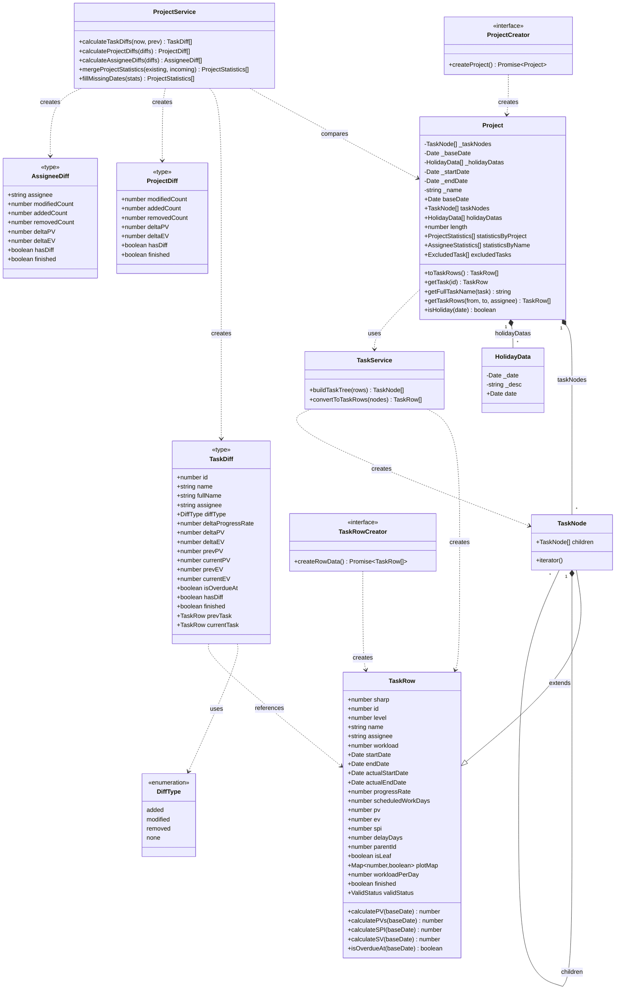

# evmtools-node コア用語集

本ドキュメントは、evmtools-nodeプロジェクトにおけるコアな用語・プロパティを定義・整理したものです。

---

## このドキュメントの読み方

| 読者 | 推奨セクション |
|------|---------------|
| 初めて触れる人 | Part I → クラス図とデータモデルの全体像を把握 |
| EVM計算の仕組みを知りたい | **Part II-1** → PV/EV/SPIの計算ロジック |
| 差分レポートを理解したい | **Part II-2** → プロジェクト間差分計算 |
| API実装・型定義を調べたい | Part III → 型定義リファレンス |

> **重要**: 本システムの価値は **Part II（業務ロジック）** にあります。データモデル（Part I）は「入れ物」であり、そこに業務ロジックが乗ることで意味を持ちます。

---

## クラス図



> **注**: 詳細なPlantUML形式のクラス図は [`class-diagram.puml`](class-diagram.puml) を参照。

---
---

# Part I: データモデル

> データの「入れ物」としての構造を説明します。

---

## 1. 基本概念

| 日本語 | 英語/クラス名 | 説明 |
|--------|--------------|------|
| プロジェクト | `Project` | タスクツリーと基準日・期間を持つEVM分析の対象単位 |
| 基準日 | `Project.baseDate` | EVM計算の基準となる日付。「この日の業務終了時点」で評価 |
| タスクノード | `TaskNode` | 階層構造を持つタスク。親子関係を表現。`Iterable`実装 |
| タスク行 | `TaskRow` | フラット化されたタスク。EVM計算メソッドを持つエンティティ |
| リーフタスク | `TaskRow.isLeaf=true` | 子を持たない末端タスク。実作業を表す。EVM集計の対象 |
| 祝日データ | `HolidayData` | プロジェクト固有の休日定義（日付・説明・ルール） |

---

## 2. Project（集約ルート）

プロジェクト全体を表す集約ルート。タスクツリーと基準日を保持する。

### 2.1 基本プロパティ

| 日本語 | プロパティ | 型 | 説明 |
|--------|-----------|-----|------|
| プロジェクト名 | `name` | `string?` | プロジェクトの名称 |
| 基準日 | `baseDate` | `Date` | EVM計算の基準日 |
| 開始日 | `startDate` | `Date?` | プロジェクト全体の開始日 |
| 終了日 | `endDate` | `Date?` | プロジェクト全体の終了日 |
| タスクノード配列 | `taskNodes` | `TaskNode[]` | ルートノードの配列 |
| 祝日データ | `holidayDatas` | `HolidayData[]` | プロジェクト固有の祝日 |
| タスク数 | `length` | `number` | フラット化後のタスク総数 |

### 2.2 取得メソッド

| 日本語 | メソッド | 戻り値 | 説明 |
|--------|---------|--------|------|
| タスク行変換 | `toTaskRows()` | `TaskRow[]` | ツリーをフラット配列に変換（キャッシュ有） |
| タスク取得 | `getTask(id)` | `TaskRow?` | IDからタスクを取得 |
| フルパス名 | `getFullTaskName(task)` | `string` | 親を遡って"/"区切り |
| 期間担当者フィルタ | `getTaskRows(from, to?, assignee?)` | `TaskRow[]` | リーフのみ抽出 |
| 除外タスク | `excludedTasks` | `ExcludedTask[]` | 計算除外タスクと理由 |
| 祝日判定 | `isHoliday(date)` | `boolean` | 祝日かどうか |

### 2.3 統計プロパティ

| 日本語 | プロパティ | 説明 |
|--------|-----------|------|
| プロジェクト統計 | `statisticsByProject` | 全体のタスク数・工数・PV/EV/SPI |
| 担当者別統計 | `statisticsByName` | 担当者ごとの集計 |
| 担当者別PV（Wide） | `pvByName` / `pvsByName` | 日別PVを横並び形式 |
| 担当者別PV（Long） | `pvByNameLong` / `pvsByNameLong` | 日別PVを縦並び形式 |
| プロジェクトPV（Wide） | `pvByProject` / `pvsByProject` | プロジェクト全体の日別PV |

---

## 3. TaskRow / TaskNode（タスク）

### 3.1 TaskRow（タスク行）

EVM計算メソッドを持つタスクエンティティ。

#### 計画系プロパティ

| 日本語 | プロパティ | 型 | 説明 |
|--------|-----------|-----|------|
| 行番号 | `sharp` | `number` | 表示順の識別子（"#"列に対応） |
| タスクID | `id` | `number` | タスクの一意な識別子 |
| 階層レベル | `level` | `number` | 1=ルート、2=子... |
| タスク名 | `name` | `string` | タスクの名称 |
| 担当者 | `assignee` | `string?` | 担当者名 |
| 予定工数 | `workload` | `number?` | 日単位の予定工数 |
| 予定開始日 | `startDate` | `Date?` | 計画上の開始日 |
| 予定終了日 | `endDate` | `Date?` | 計画上の終了日 |
| 稼働予定日数 | `scheduledWorkDays` | `number?` | 計画上の稼働日数 |
| 稼働日マップ | `plotMap` | `Map<number, boolean>?` | Excelシリアル値→稼働日フラグ |
| 親タスクID | `parentId` | `number?` | 親ノードのID |
| リーフ判定 | `isLeaf` | `boolean?` | 末端タスクか |
| 備考 | `remarks` | `string?` | 自由記述 |

#### 実績系プロパティ

| 日本語 | プロパティ | 型 | 説明 |
|--------|-----------|-----|------|
| 実績開始日 | `actualStartDate` | `Date?` | 実際の開始日 |
| 実績終了日 | `actualEndDate` | `Date?` | 実際の終了日 |
| 進捗率 | `progressRate` | `number?` | 0.0〜1.0。1.0で完了 |
| 進捗応当日 | `expectedProgressDate` | `Date?` | 現在の進捗率に相当する予定日 |
| 遅延日数 | `delayDays` | `number?` | 正=遅延、負=前倒し |

#### EVM関連プロパティ

| 日本語 | プロパティ | 型 | 説明 |
|--------|-----------|-----|------|
| 計画価値（Excel） | `pv` | `number?` | Excelから読み込んだPV |
| 出来高 | `ev` | `number?` | 実際に完了した作業の価値 |
| スケジュール効率 | `spi` | `number?` | Excelから読み込んだSPI |

#### 算出プロパティ/メソッド

| 日本語 | プロパティ/メソッド | 説明 |
|--------|-------------------|------|
| 1日あたり工数 | `workloadPerDay` | `workload / scheduledWorkDays` |
| 完了判定 | `finished` | `progressRate === 1.0` |
| 期限切れ判定 | `isOverdueAt(baseDate)` | `endDate <= baseDate` かつ未完了 |
| 有効性チェック | `validStatus` | 日付・plotMap・稼働日数の検証結果 |

### 3.2 TaskNode（タスクノード）

`TaskRow`を継承し、階層構造を表現する。

| プロパティ/メソッド | 説明 |
|-------------------|------|
| `children: TaskNode[]` | 子ノードの配列 |
| `[Symbol.iterator]()` | ツリー走査用イテレータ |

---

## 4. HolidayData（祝日）

プロジェクト固有の祝日定義。

| プロパティ | 型 | 説明 |
|-----------|-----|------|
| `date` | `Date` | 祝日の日付 |
| `desc` | `string?` | 説明（例: "元日"） |
| `rule` | `string?` | ルール定義 |

---
---

# Part II: 業務ロジック

> **★ 本システムの価値はここにあります。** データモデルに対して適用される計算ロジックを説明します。

---

## 5. EVM計算

### 5.1 EVM指標の概要

EVM（Earned Value Management）は、プロジェクトの進捗を定量的に測定する手法です。

| 指標 | 日本語 | 計算式 | 意味 |
|------|--------|--------|------|
| **PV** | 計画価値 | - | 基準日までに完了予定だった作業量 |
| **EV** | 出来高 | 進捗率 × 工数 | 実際に完了した作業の価値 |
| **SPI** | スケジュール効率 | EV / PV | 1.0以上なら予定通り |
| **SV** | スケジュール差異 | EV - PV | 正なら前倒し、負なら遅延 |

### 5.2 PV（計画価値）の計算

本システムでは、PVを **2つの方法** で取得・算出できます。

| 種別 | 取得方法 | 説明 | 用途 |
|------|----------|------|------|
| **Excel取得PV** | `TaskRow.pv` | Excelから直接読み込んだ値 | データ整合性確認 |
| **計算PV** | `TaskRow.calculatePV(baseDate)` | 工数÷稼働日数で算出 | 日別分析、SPI/SV計算 |

#### Excel取得PV (`TaskRow.pv`)

- Excelの「PV」列から読み込んだ値
- 統計集計時は `Statistics.totalPvExcel` として合算
- Excelで手動設定された値をそのまま使用

#### 計算PV (`TaskRow.calculatePV`, `TaskRow.calculatePVs`)

```typescript
// 1日あたりのPV
workloadPerDay = workload / scheduledWorkDays

// 基準日のPV（その日のみ）
calculatePV(baseDate): number
  → 基準日が稼働日なら workloadPerDay、そうでなければ 0

// 累積PV（基準日まで）
calculatePVs(baseDate): number
  → 基準日以前の稼働日について calculatePV を合算
```

#### SPI/SV の計算

```typescript
// SPI = EV / 累積PV
calculateSPI(baseDate): number
  → ev / calculatePVs(baseDate)

// SV = EV - 累積PV
calculateSV(baseDate): number
  → ev - calculatePVs(baseDate)
```

### 5.3 稼働日の判定

PV計算において「稼働日」の判定は重要な要素です。

#### plotMap（稼働日マップ）

| 項目 | 説明 |
|------|------|
| 構造 | `Map<number, boolean>` |
| キー | Excelの日付シリアル値（`date2Sn(date)`で変換） |
| 値 | `true`（稼働日） |
| データソース | Excelガントチャート上の「□」プロット |

```
例: 2025/06/09〜2025/06/13 の5日間タスク（土日除く）
plotMap = {
  45817: true,  // 2025/06/09 (月)
  45818: true,  // 2025/06/10 (火)
  45819: true,  // 2025/06/11 (水)
  45820: true,  // 2025/06/12 (木)
  45821: true,  // 2025/06/13 (金)
}
```

#### 稼働日判定ロジック

```typescript
function isInRange(baseDate, startDate, endDate, plotMap): boolean {
  return plotMap.get(baseSerial) === true  // plotMapに存在
      && startSerial <= baseSerial         // 開始日以降
      && baseSerial <= endSerial           // 終了日以前
}
```

#### scheduledWorkDays と plotMap の関係

| 項目 | 説明 |
|------|------|
| `scheduledWorkDays` | Excelの「稼働予定日数」列から取得 |
| `plotMap.size` | 実際にプロットされている日数 |
| 整合性 | 通常は一致するが、入力ミスで不一致の場合あり |
| PV計算 | `plotMap`を優先、日数計算は `workload / scheduledWorkDays` |

### 5.4 HolidayData と稼働日の関係

#### 重要な違い

| 項目 | `TaskRow.plotMap` | `HolidayData` |
|------|-------------------|---------------|
| 管理単位 | タスク単位 | プロジェクト単位 |
| データソース | Excelガントチャートのプロット | Excelの祝日シート |
| 用途 | **PV計算の稼働日判定** | 祝日判定・要員計画など |
| PV計算への影響 | **直接使用される** | 直接使用されない |

#### 関係性

```
PV計算（TaskRow.calculatePV）
  └── plotMap を参照（Excelプロットが稼働日）
      ※ HolidayData は参照しない

祝日判定（Project.isHoliday）
  └── HolidayData + 土日 を判定
      ※ plotMap は参照しない
```

> **重要**: PV計算とHolidayDataは独立しています。Excelでガントチャートを作成する際、祝日にはプロットを入れないことで稼働日から除外される想定です。

---

## 6. プロジェクト間差分計算

### 6.1 概要

`ProjectService`は、2つの時点のProject（`now`と`prev`）を比較し、タスク単位の差分を計算します。これにより、プロジェクトの進捗変化を可視化できます。

```
prev (前回スナップショット)    now (今回スナップショット)
       ↓                              ↓
       └───── ProjectService.calculateTaskDiffs() ─────→ TaskDiff[]
                                                              ↓
                          ┌───────────────────────────────────┴───────────────────────────────────┐
                          ↓                                                                       ↓
              calculateProjectDiffs()                                              calculateAssigneeDiffs()
                          ↓                                                                       ↓
                   ProjectDiff                                                          AssigneeDiff[]
              (プロジェクト全体の集約)                                                 (担当者別の集約)
```

### 6.2 差分計算の対象

- **リーフタスクのみ**が対象（`isLeaf === true`）
- 親タスク（サマリータスク）は対象外

### 6.3 DiffType（差分種別）

| 差分種別 | 値 | 判定条件 | 説明 |
|---------|-----|----------|------|
| 追加 | `'added'` | `prev`に存在しない | 新規追加されたタスク |
| 変更 | `'modified'` | 進捗率・PV・EVのいずれかに変化 | 更新されたタスク |
| 削除 | `'removed'` | `now`に存在しない | 削除されたタスク |
| 変化なし | `'none'` | 差分なし | 変更のないタスク |

#### 変更判定ロジック

```typescript
const hasAnyChange =
    isNew ||
    [deltaProgressRate, deltaPV, deltaEV].some((d) => d !== undefined && d !== 0)

diffType = isNew ? 'added' : hasAnyChange ? 'modified' : 'none'
```

### 6.4 ProjectService メソッド

| メソッド | 引数 | 戻り値 | 説明 |
|---------|------|--------|------|
| `calculateTaskDiffs` | `now: Project, prev: Project` | `TaskDiff[]` | タスク単位の差分を計算 |
| `calculateProjectDiffs` | `taskDiffs: TaskDiff[]` | `ProjectDiff[]` | プロジェクト全体で集約 |
| `calculateAssigneeDiffs` | `taskDiffs: TaskDiff[]` | `AssigneeDiff[]` | 担当者別に集約 |
| `mergeProjectStatistics` | `existing, incoming` | `ProjectStatistics[]` | 同じ基準日は上書きでマージ |
| `fillMissingDates` | `stats: ProjectStatistics[]` | `ProjectStatistics[]` | 欠落日を前日データで補間 |

### 6.5 使用例

```typescript
import { ProjectService } from 'evmtools-node/domain'

const service = new ProjectService()

// 2つの時点のProjectを取得（例: now.xlsm, prev.xlsm）
const now: Project = await createProject('now.xlsm')
const prev: Project = await createProject('prev.xlsm')

// タスク単位の差分を計算
const taskDiffs = service.calculateTaskDiffs(now, prev)

// 差分があるタスクのみ抽出
const changedTasks = taskDiffs.filter(d => d.hasDiff)

// プロジェクト全体の集約
const projectDiff = service.calculateProjectDiffs(taskDiffs)
console.log(`追加: ${projectDiff[0].addedCount}, 変更: ${projectDiff[0].modifiedCount}`)

// 担当者別の集約
const assigneeDiffs = service.calculateAssigneeDiffs(taskDiffs)
for (const diff of assigneeDiffs) {
    console.log(`${diff.assignee}: EV変化 ${diff.deltaEV}`)
}
```

---
---

# Part III: 型定義リファレンス

> APIを利用する際の型定義の詳細です。

---

## 7. 差分型

### 7.1 TaskDiff（タスク差分）

タスク単位の差分情報。`calculateTaskDiffs()`の戻り値。

#### 識別・基本情報

| プロパティ | 型 | 説明 |
|-----------|-----|------|
| `id` | `number` | タスクID |
| `name` | `string` | タスク名 |
| `fullName` | `string` | 親を含む完全なタスク名（"/"区切り） |
| `assignee` | `string?` | 担当者 |
| `parentId` | `number?` | 親タスクID |
| `workload` | `number?` | 予定工数 |

#### 差分判定

| プロパティ | 型 | 説明 |
|-----------|-----|------|
| `diffType` | `DiffType` | `'added'` / `'modified'` / `'removed'` / `'none'` |
| `hasDiff` | `boolean` | 差分があるか |
| `hasProgressRateDiff` | `boolean` | 進捗率に変化があるか |
| `hasPvDiff` | `boolean` | PVに変化があるか |
| `hasEvDiff` | `boolean` | EVに変化があるか |
| `finished` | `boolean` | 完了済みか（`progressRate === 1.0`） |

#### 変化量（Delta）

| プロパティ | 型 | 説明 |
|-----------|-----|------|
| `deltaProgressRate` | `number?` | 進捗率の変化量（`now - prev`） |
| `deltaPV` | `number?` | PVの変化量 |
| `deltaEV` | `number?` | EVの変化量 |

#### 前回値・今回値

| プロパティ | 型 | 説明 |
|-----------|-----|------|
| `prevProgressRate` | `number?` | 前回の進捗率 |
| `currentProgressRate` | `number?` | 今回の進捗率 |
| `prevPV` | `number?` | 前回のPV |
| `currentPV` | `number?` | 今回のPV |
| `prevEV` | `number?` | 前回のEV |
| `currentEV` | `number?` | 今回のEV |

#### 基準日・期限情報

| プロパティ | 型 | 説明 |
|-----------|-----|------|
| `prevBaseDate` | `Date?` | 前回の基準日 |
| `currentBaseDate` | `Date?` | 今回の基準日 |
| `baseDate` | `Date?` | 評価基準日（通常は`currentBaseDate`） |
| `isOverdueAt` | `boolean` | 基準日時点で期限切れか |
| `daysOverdueAt` | `number?` | 基準日から終了日への相対日数（負=遅延） |
| `daysStrOverdueAt` | `string?` | 遅延日数の文字列表現 |

#### TaskRow参照

| プロパティ | 型 | 説明 |
|-----------|-----|------|
| `prevTask` | `TaskRow?` | 前回のTaskRow |
| `currentTask` | `TaskRow?` | 今回のTaskRow（削除時はundefined） |

### 7.2 ProjectDiff（プロジェクト差分集約）

プロジェクト全体の差分を集約した情報。`calculateProjectDiffs()`の戻り値。

| プロパティ | 型 | 説明 |
|-----------|-----|------|
| `modifiedCount` | `number` | 変更されたタスク数 |
| `addedCount` | `number` | 追加されたタスク数 |
| `removedCount` | `number` | 削除されたタスク数 |
| `deltaPV` | `number?` | PV変化量の合計 |
| `deltaEV` | `number?` | EV変化量の合計 |
| `prevPV` | `number?` | 変化があったタスクの前回PV合計 |
| `currentPV` | `number?` | 変化があったタスクの今回PV合計 |
| `prevEV` | `number?` | 変化があったタスクの前回EV合計 |
| `currentEV` | `number?` | 変化があったタスクの今回EV合計 |
| `hasDiff` | `boolean` | 差分があるか |
| `finished` | `boolean` | 全タスクが完了か |

### 7.3 AssigneeDiff（担当者差分集約）

担当者別の差分を集約した情報。`calculateAssigneeDiffs()`の戻り値。

| プロパティ | 型 | 説明 |
|-----------|-----|------|
| `assignee` | `string?` | 担当者名 |
| `modifiedCount` | `number` | 変更されたタスク数 |
| `addedCount` | `number` | 追加されたタスク数 |
| `removedCount` | `number` | 削除されたタスク数 |
| `deltaPV` | `number?` | PV変化量の合計 |
| `deltaEV` | `number?` | EV変化量の合計 |
| `prevPV` | `number?` | 変化があったタスクの前回PV合計 |
| `currentPV` | `number?` | 変化があったタスクの今回PV合計 |
| `prevEV` | `number?` | 変化があったタスクの前回EV合計 |
| `currentEV` | `number?` | 変化があったタスクの今回EV合計 |
| `hasDiff` | `boolean` | 差分があるか |
| `finished` | `boolean` | 担当タスク全てが完了か |

---

## 8. 統計型

### 8.1 Statistics（共通統計）

| プロパティ | 型 | 説明 |
|-----------|-----|------|
| `totalTasksCount` | `number?` | タスク総数 |
| `totalWorkloadExcel` | `number?` | Excel工数の合計 |
| `totalWorkloadCalculated` | `number?` | 計算による工数合計 |
| `averageWorkload` | `number?` | 平均工数 |
| `baseDate` | `string` | 基準日（文字列） |
| `totalPvExcel` | `number?` | Excel累積PV |
| `totalPvCalculated` | `number?` | 計算累積PV |
| `totalEv` | `number?` | 累積EV |
| `spi` | `number?` | SPI |

### 8.2 ProjectStatistics

`Statistics` を拡張し、プロジェクト固有の情報を追加。

| 追加プロパティ | 型 | 説明 |
|---------------|-----|------|
| `projectName` | `string?` | プロジェクト名 |
| `startDate` | `string` | 開始日 |
| `endDate` | `string` | 終了日 |

### 8.3 AssigneeStatistics

`Statistics` を拡張し、担当者固有の情報を追加。

| 追加プロパティ | 型 | 説明 |
|---------------|-----|------|
| `assignee` | `string?` | 担当者名 |

---

## 9. データ形式

| 形式 | 説明 | 用途 |
|------|------|------|
| Wide形式 | 担当者を行、日付を列とした横並び | Excel出力向け |
| Long形式 | `{assignee, baseDate, value}` の縦並び | 集計・グラフ向け |

---
---

## 関連ファイル

| ファイル | 説明 |
|----------|------|
| `src/domain/TaskRow.ts` | TaskRowエンティティ |
| `src/domain/TaskNode.ts` | TaskNodeエンティティ |
| `src/domain/Project.ts` | Projectエンティティ |
| `src/domain/ProjectService.ts` | 差分計算サービス |
| `src/domain/HolidayData.ts` | 祝日データ |
